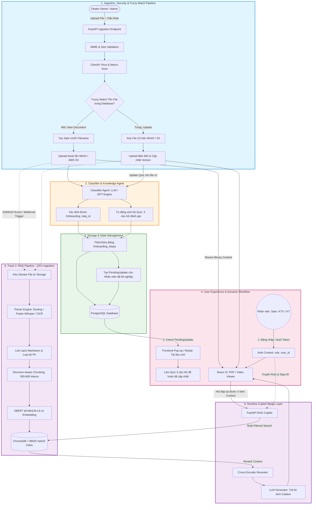
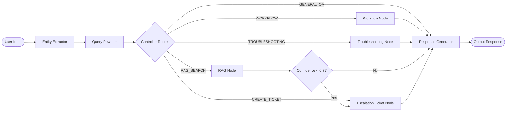

# Architecture Document - AI Agent Hỗ trợ Onboarding ĐLPP Xe Máy Điện (Team T223)

## System Overview

Hệ thống AI Agent hỗ trợ onboarding và vận hành cho **Đại lý Phân phối (ĐLPP) Xe máy Điện** được thiết kế theo kiến trúc **Dynamic Agent Controller & Intent Router**. Kiến trúc cho phép hệ thống phân loại linh hoạt ý định người dùng (Intent Classification), trích xuất ngữ cảnh dòng xe/mã lỗi, phân quyền tra cứu tài liệu theo vai trò (RBAC Security), và tự động chuyển tiếp yêu cầu tới IT/Quản lý khi dữ liệu không đủ.

## Overall System Architecture Diagram

---

## Agent Pipeline Flow (LangGraph StateGraph)

---

## Components Detail

### 1. Entity Extractor Node (`entity_extractor.py`)
- Trích xuất tự động **Dòng xe máy điện** (`Klara S`, `Feliz S`, `Vento S`, `Evo200`) và **Mã lỗi kỹ thuật** (`P01`, `E03`, `BMS_OVERHEAT`).

### 2. Query Rewriter & Role Context Enhancer (`query_rewriter.py`)
- Chuẩn hóa thuật ngữ viết tắt của ngành xe điện và bổ sung thông tin vai trò người dùng (`sales`, `accounting`, `technician`, `manager`, `it`).

### 3. Dynamic Controller Router (`controller.py`)
- Node phân loại Intent câu hỏi và điều hướng luồng xử lý tới các Node chuyên biệt.

### 4. Role-Filtered RAG Node (`rag_node.py`)
- Tìm kiếm tài liệu nghiệp vụ/chính sách với bộ lọc **RBAC Security** (ngăn nhân viên Sales xem chiết khấu/giá nhập kho dành riêng cho Manager).
- Đánh giá chỉ số `rag_confidence`. Nếu dưới 0.7, tự động chuyển luồng sang `Escalation Node`.

### 5. Role Workflow Navigator Node (`workflow_node.py`)
- Cung cấp sơ đồ quy trình bán hàng, kế toán, bảo hành và lộ trình tự học onboarding theo vai trò.

### 6. Troubleshooting & Diagnostic Node (`troubleshooting_node.py`)
- Trả về bảng hướng dẫn xử lý sự cố nhanh tại xưởng dịch vụ kèm các **Cảnh báo an toàn điện (CAUTION Alert)**.

### 7. Escalation Ticket Creator (`escalation_node.py`)
- Khởi tạo Ticket hỗ trợ có cấu trúc (`ticket_id`, `vehicle_model`, `error_code`, `department`) gửi IT hoặc Quản lý ĐLPP theo yêu cầu tại FR-15 & US-05.

### 8. Grounded Response Generator (`response_generator.py`)
- Tổng hợp phản hồi Markdown chuẩn hóa kèm trích dẫn nguồn tài liệu ([Trang X - File Y]) và đề xuất hành động tiếp theo.

---

## Design Decisions (ADR)

| Quyết định | Giải pháp lựa chọn | Lý do thiết kế |
|------------|-------------------|----------------|
| Kiến trúc Agent | LangGraph Dynamic Controller | Cho phép chuyển hướng linh hoạt theo Intent & Confidence thay vì luồng tuyến tính cố định. |
| Security | RBAC Filter at RAG Retrieval Level | Đảm bảo nhân viên mới không tra cứu được các thông tin tài chính/chiết khấu nhạy cảm. |
| Xử lý câu hỏi khó/lỗi | Auto IT/Manager Escalation Ticket Payload | Đáp ứng yêu cầu PRD (FR-15 & US-05): Không bịa câu trả lời khi thiếu dữ liệu. |
| Format câu trả lời | Markdown + Alerts + Citations | Giúp Kỹ thuật viên & Sales đọc nhanh checklist từng bước thay vì các đoạn văn dài. |
