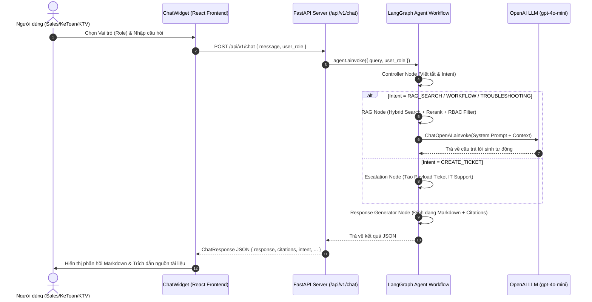

# Tài liệu Kỹ thuật Tính năng Chatbot RAG (VF AI Onboarding & Operational Support Agent)

Tài liệu này mô tả chi tiết kiến trúc, luồng dữ liệu (Data Flow), luồng người dùng (User Flow), chi tiết chức năng từng file trong codebase và hướng dẫn chạy hệ thống Chatbot RAG thông minh dành cho đại lý xe máy điện VinFast.

---

## 1. Tổng quan Kiến trúc Tính năng Chatbot

Chatbot được xây dựng dựa trên kiến trúc **Multi-Agent RAG (Retrieval-Augmented Generation)** kết hợp với **LangGraph**, **Hybrid Search (ChromaDB + BM25Okapi)**, **Cross-Encoder Reranking** và **Phân quyền truy cập tài liệu theo vai trò (RBAC)**.

### Mẫu Kiến trúc (Architectural Pattern):
- **Fast Router Controller**: Phân loại ý định (Intent) và mở rộng từ khóa viết tắt siêu tốc (<100ms).
- **Hybrid Retrieval**: Kết hợp Vector Semantic Search (ChromaDB) và Keyword Exact Match (BM25Okapi) bằng thuật toán Reciprocal Rank Fusion (RRF).
- **Cross-Encoder Reranking**: Tái xếp hạng các đoạn tài liệu retrieved bằng mô hình `cross-encoder/ms-marco-MiniLM-L-6-v2`.
- **Role-Based Access Control (RBAC)**: Lọc tài liệu theo vai trò người dùng (`sales`, `accounting`, `technician`, `general`).
- **Singleton Model Pre-loading**: Load trước toàn bộ mô hình AI vào bộ nhớ RAM khi Backend FastAPI khởi động.

---

## 2. Luồng Người dùng (User Flow)



---

## 3. Luồng Dữ liệu (Data Flow trong Agent Workflow)

```mermaid
graph TD
    A[User Input: message, user_role] --> B[Controller Node]
    
    subgraph "Controller Processing"
        B --> B1[Expand Viết tắt: dlpp, vat, bms, pin lfp, vin]
        B1 --> B2[Fast Intent Classifier]
    end
    
    B2 -->|Intent: RAG_SEARCH / WORKFLOW / TROUBLESHOOTING| C[RAG Node]
    B2 -->|Intent: CREATE_TICKET| D[Escalation Node]

    subgraph "RAG Node Execution"
        C --> C1[Xác định Access Scope từ user_role]
        C1 --> C2["Hybrid Search (Fetch Top 15)"]
        
        subgraph "Hybrid Retrieval Layer"
            C2 --> C2a["ChromaDB Vector Search (role filter)"]
            C2 --> C2b["BM25 Keyword Search (role filter)"]
            C2a & C2b --> C2c[Reciprocal Rank Fusion RRF]
        end
        
        C2c --> C3["Cross-Encoder Reranking (Select Top 5)"]
        C3 --> C4[Build Prompt Context]
        C4 --> C5[LLM ainvoke gpt-4o-mini]
    end

    subgraph "Escalation Node Execution"
        D --> D1[Tạo Payload Yêu cầu Hỗ trợ IT Ticket]
    end

    C5 --> E[Response Generator Node]
    D1 --> E

    subgraph "Response Formatting"
        E --> E1[Định dạng Markdown Chi tiết]
        E1 --> E2[Đính kèm Trích dẫn Nguồn: 📖 [Tài liệu (Mục)]]
        E2 --> E3[Đề xuất Gợi ý Hành động Tiếp theo]
    end

    E3 --> F[Return ChatResponse JSON to Client]
```

---

## 4. Cấu trúc Thư mục & Chức năng Chi tiết từng File

```
P-223/
├── src/
│   ├── main.py                     # FastAPI Application Entrypoint & Startup Lifespan
│   ├── config.py                   # Cấu hình hệ thống, Role Mapping, PII, LLM Settings
│   ├── api/
│   │   ├── routes.py               # Router API (/chat, /status)
│   │   ├── auth_routes.py          # Router Authentication (JWT Auth)
│   │   └── media_routes.py         # Router xem tài liệu PDF/Media
│   ├── agents/
│   │   ├── graph.py                # Định dạng StateGraph & Routing Logic cho Agent
│   │   ├── state.py                # Schema AgentState của LangGraph
│   │   └── nodes/
│   │       ├── controller.py       # Smart Router, Chuẩn hóa từ viết tắt, Phân loại Ý định
│   │       ├── rag_node.py         # Node xử lý RAG, Pre-load Models, Reranking & Gọi LLM
│   │       ├── troubleshooting_node.py # Chẩn đoán & Hướng dẫn xử lý sự cố kỹ thuật
│   │       ├── workflow_node.py    # Hướng dẫn quy trình nghiệp vụ & onboarding
│   │       ├── escalation_node.py  # Xử lý chuyển tiếp yêu cầu (Ticket IT Support)
│   │       └── response_generator.py # Tổng hợp văn bản Markdown & Trích dẫn nguồn
│   ├── vectordb/
│   │   ├── chroma_store.py         # Tìm kiếm Vector bằng ChromaDB & Lọc role metadata
│   │   ├── bm25_store.py           # Tìm kiếm từ khóa BM25Okapi & Lọc role metadata
│   │   ├── hybrid_search.py        # Kết hợp ChromaDB + BM25 bằng Reciprocal Rank Fusion
│   │   └── reranker.py             # Re-score bằng Cross-Encoder (ms-marco-MiniLM-L-6-v2)
│   ├── embedding/
│   │   └── embedder.py             # Embedding Service (all-MiniLM-L6-v2) với Singleton Cache
│   └── services/
│       └── llm.py                  # Wrapper khởi tạo LangChain ChatOpenAI
└── frontend/
    └── src/
        ├── components/chat/
        │   └── ChatWidget.tsx      # Giao diện Chatbot Widget (React, Markdown Rendering)
        └── services/
            └── api.ts              # Client gửi request HTTP tới API backend
```

---

### Chi tiết Chức năng Các File Core Backend

| Tên File | Chức năng & Vai trò |
| :--- | :--- |
| **`src/main.py`** | Khởi tạo ứng dụng FastAPI. Chứa hàm `lifespan(app)` thực hiện **tải sẵn toàn bộ AI Models** (`init_rag_models`) khi server khởi động để tránh độ trễ khi user chat. Cấu hình CORS middleware và mount API routes. |
| **`src/config.py`** | Định nghĩa đối tượng `Settings` dùng Pydantic BaseSettings. Quản lý các tham số cấu hình: API key, `role_mapping`, `access_scope_mapping`, tên mô hình LLM/Embedding/Reranker, vị trí kho lưu trữ ChromaDB. |
| **`src/api/routes.py`** | Định nghĩa endpoint `POST /api/v1/chat` tiếp nhận payload `ChatRequest` (gồm `message`, `user_role`) và gọi `agent.ainvoke()`. |
| **`src/agents/graph.py`** | Xây dựng luồng thực thi LangGraph (`StateGraph`). Kết nối các node (`controller`, `rag`, `troubleshooting`, `workflow`, `escalation`, `response_generator`) và điều hướng bằng `route_intent`. |
| **`src/agents/nodes/controller.py`** | Controller siêu tốc (<100ms). Mở rộng các từ viết tắt chuyên ngành VinFast (vd: `dlpp` -> `đại lý phân phối`, `bms` -> `hệ thống quản lý pin bms`) và dùng luật Heuristic để phân loại intent. |
| **`src/agents/nodes/rag_node.py`** | Node cốt lõi thực hiện tra cứu tài liệu. Gọi `HybridRetriever` lấy Top 15 tài liệu thỏa mãn `user_role`, dùng `RerankerService` chọn ra Top 5 tốt nhất, dựng Context Prompt và gọi `ChatOpenAI` để sinh câu trả lời. |
| **`src/vectordb/hybrid_search.py`** | Thuật toán Hybrid Search kết hợp điểm số của Vector Search (Cosine Similarity) và Keyword Search (BM25) theo công thức Reciprocal Rank Fusion: $RRF(d) = \sum \frac{w}{k + r(d)}$. |
| **`src/vectordb/chroma_store.py`** | Quản lý ChromaDB Persistent Client. Thực hiện truy vấn Vector Embeddings kèm bộ lọc metadata `where={"role": {"$in": scopes}}`. |
| **`src/vectordb/bm25_store.py`** | Quản lý BM25 Index. Tokenize tiếng Việt/Anh và tính điểm tần suất từ khóa BM25Okapi, loại bỏ các tài liệu không đúng vai trò của user. |
| **`src/vectordb/reranker.py`** | Đánh giá điểm tương quan ngữ cảnh giữa `Query` và `Document Chunk` bằng mô hình Cross-Encoder `cross-encoder/ms-marco-MiniLM-L-6-v2`. |
| **`src/embedding/embedder.py`** | Chuyển đổi văn bản thành Vector Float (384 chiều) bằng mô hình `sentence-transformers/all-MiniLM-L6-v2`. Áp dụng Pattern Singleton để lưu cache model trong RAM. |
| **`frontend/src/components/chat/ChatWidget.tsx`** | Giao diện khung Chat phía Client: Chọn role (Kế toán, Sale, Kỹ thuật viên), hiển thị lịch sử chat, định dạng Markdown (bảng biểu, mã nguồn, danh sách), hiển thị nguồn trích dẫn tài liệu. |

---

## 5. Hướng dẫn Chạy Hệ thống Chatbot

### Bước 1: Chuẩn bị Môi trường Backend (Python)

1. Mở terminal tại thư mục gốc dự án (`e:\P-223`).
2. Kích hoạt môi trường ảo Python:
   - **Windows (PowerShell)**:
     ```powershell
     .\.venv\Scripts\Activate.ps1
     ```
3. Đảm bảo file `.env` tại gốc dự án đã có cấu hình `OPENAI_API_KEY`:
   ```env
   OPENAI_API_KEY=your_openai_api_key_here
   MODEL_NAME=gpt-4o-mini
   CHROMA_PERSIST_DIR=./data/chroma
   ```

### Bước 2: Khởi chạy Backend FastAPI

Chạy lệnh Uvicorn để khởi động Backend server:
```powershell
uvicorn src.main:app --port 8001 --reload
```
- Khi khởi động, bạn sẽ thấy log thông báo pre-load các mô hình AI:
  ```text
  Starting AI20K Agent in development mode
  Initializing and pre-loading RAG models on backend startup...
  Loading embedding model: sentence-transformers/all-MiniLM-L6-v2
  Loading Cross-Encoder model: cross-encoder/ms-marco-MiniLM-L-6-v2
  RAG models pre-loaded and warmed up successfully.
  INFO:     Application startup complete.
  ```

### Bước 3: Khởi chạy Frontend React (Vite)

1. Mở terminal mới, di chuyển vào thư mục `frontend`:
   ```powershell
   cd frontend
   ```
2. Chạy server phát triển Frontend:
   ```powershell
   npm run dev
   ```
3. Truy cập giao diện ứng dụng tại: `http://localhost:3000` (hoặc port do Vite cấp).

---

## 6. Kiểm tra & Test API trực tiếp

### Kiểm tra Health Endpoint:
```powershell
curl http://localhost:8001/health
```
**Phản hồi:**
```json
{"status": "ok", "env": "development"}
```

### Test API Chat bằng `curl` / `Postman`:
```powershell
curl -X POST "http://localhost:8001/api/v1/chat" `
     -H "Content-Type: application/json" `
     -d '{"message": "Chính sách chiết khấu dành cho đại lý bán hàng là gì?", "user_role": "sales"}'
```

**Phản hồi Mẫu (`ChatResponse`):**
```json
{
  "response": "Chính sách chiết khấu dành cho đại lý phân phối bán hàng được quy định như sau:\n- Chiết khấu doanh số hàng tháng: 5%\n- Chiết khấu hoàn thành KPI quý: 2%\n\n---\n**Nguồn trích dẫn tài liệu nội bộ:**\n- 📖 [Tài liệu Quy chế Sale (Mục 3.1)]",
  "analysis": "Smart Router (Fast Classifier 12.5ms): Intent = RAG_SEARCH (Confidence: 88%)",
  "intent": "RAG_SEARCH",
  "citations": ["Tài liệu Quy chế Sale (Mục 3.1)"],
  "needs_escalation": false,
  "ticket_payload": null
}
```
