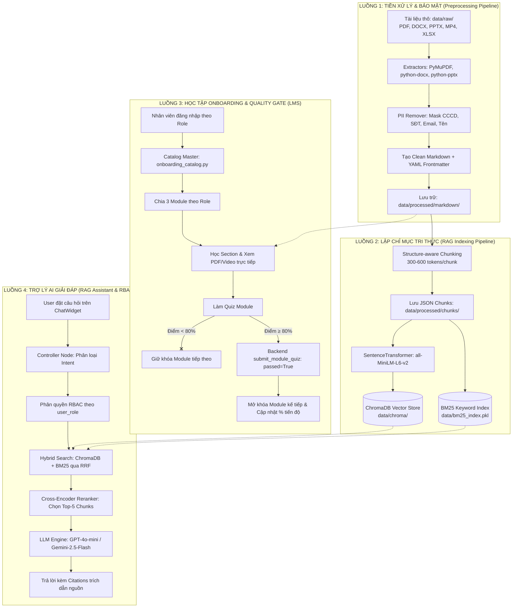

# TÀI LIỆU QUY ĐỊNH DATAFLOW VÀ PHÂN BỔ TÀI LIỆU THEO ROLE / MODULE
## DỰ ÁN HỆ THỐNG ONBOARDING & TRỢ LÝ AI ĐẠI LÝ XE MÁY ĐIỆN VINFAST

---

## 📌 PHẦN 1: TỔNG QUAN LUỒNG DỮ LIỆU TOÀN DỰ ÁN (DATAFLOW)

Hệ thống được vận hành bởi 4 luồng dữ liệu chính kết nối từ tầng dữ liệu thô (Raw Data), tầng lưu trữ tri thức (Knowledge Base), tầng học tập (Onboarding LMS) đến tầng Trợ lý AI (RAG Assistant).



---

## 📁 PHẦN 2: CẤU TRÚC VÀ QUY ĐỊNH THƯ MỤC DỮ LIỆU

### 1. Thư mục `data/raw/` (Tài liệu gốc)
Toàn bộ tài liệu do VinFast ban hành được phân chia theo 5 nhóm thư mục chính:
* `General_doc/`: 4 tài liệu văn hóa chung, tổng quan sản phẩm, chính sách bán hàng và chăm sóc xe.
* `Sale/`: 2 tài liệu chuẩn dịch vụ, quy trình & kỹ năng bán hàng 7 bước.
* `KeToan/`: 42 tài liệu văn bản và video hướng dẫn chi tiết hệ thống DMS, quản lý đơn hàng PO/PR, hóa đơn, claim.
* `KTV/`: 5 tài liệu chính sách bảo hành, mở lệnh sửa chữa RO, chẩn đoán xử lý lỗi pin LFP, quy chuẩn xưởng 3S.
* `Manager/`: 1 tài liệu checklist nghiệm thu và tiêu chuẩn vận hành Showroom/Xưởng 3S.

### 2. Thư mục `data/processed/markdown/` (Markdown sạch chuẩn hóa)
* Mỗi file `.md` đều chứa **YAML Frontmatter** ở đầu file với cấu trúc chuẩn:
```yaml
---
document_id: SALE001_QUY_TRINH_BAN_HANG
title: Quy trình và Kỹ năng bán hàng XMĐ
role: sales
category: Sale
source_file: Sale/4. Tài liệu Quy trình và Kỹ năng bán hàng XMĐ.pdf
---
```
* Phần nội dung thân (body) đã được loại bỏ thông tin nhạy cảm (PII) và chuẩn hóa phân cấp đề mục (`#`, `##`, `###`).

### 3. Thư mục `data/processed/chunks/`
* Chứa các file `.json` tương ứng với từng tài liệu. Mỗi chunk chứa: `chunk_id`, `content`, `token_count`, `heading_hierarchy`, `role`, `source_file`.

### 4. Cơ sở dữ liệu Vector & Từ khóa (`data/chroma/` & `data/bm25_index.pkl`)
* `data/chroma/`: Lưu trữ 1.167 vector embeddings chuẩn hóa cosine.
* `data/bm25_index.pkl`: Lưu trữ 198 tài liệu BM25 phục vụ tra cứu từ khóa chính xác.

---

## 🔐 PHẦN 3: MA TRẬN PHÂN QUYỀN TRUY CẬP DỮ LIỆU (RBAC)

| Vai trò người dùng (Role) | Mã Role hệ thống | Phạm vi truy cập dữ liệu (Access Scope) |
| :--- | :--- | :--- |
| **Tư vấn bán hàng (Sales)** | `sales` / `sale` | `sales`, `general` |
| **Kế toán đại lý (Accountant)** | `accounting` / `accountant` | `accounting`, `general` |
| **Kỹ thuật viên (Technician)** | `technician` | `technician`, `general` |
| **Chủ / Quản lý đại lý (Owner/Manager)** | `owner` / `manager` | `sales`, `accounting`, `technician`, `owner`, `general` *(Toàn quyền)* |

---

## 📚 PHẦN 4: QUY ĐỊNH CHI TIẾT CÁC FILE TRONG TỪNG MODULE / ROLE

Mỗi vai trò được quy chuẩn đồng bộ thành **3 Module học tập**:
* **Module 1: Tổng quan và hội nhập** (Nội dung văn hóa chung của VinGroup và Tổng quan sản phẩm).
* **Module 2: Kiến thức chuyên môn** (Nghiệp vụ chuyên sâu đặc thù của từng vai trò).
* **Module 3: Chương trình hiện tại đang triển khai còn hiệu lực** (Chính sách, ưu đãi, biểu mẫu claim và vận hành hiện hành).

---

### 🟢 1. VAI TRÒ: TƯ VẤN BÁN HÀNG (SALES)

#### 🔹 Module 1: Tổng quan và hội nhập
* **Mục tiêu**: Nắm sứ mệnh di chuyển xanh, văn hóa VinGroup và tổng quan các dòng xe máy điện.
* **Tài liệu học tập đính kèm**:
  1. `General_doc/1. Tài liệu Tự hào VinGroup.pdf` (PDF)
  2. `General_doc/2. Lịch sử & Tổng quan sản phẩm XMĐ_260617.pdf` (PDF)
* **Quiz kiểm tra (3 câu)**: Tiêu chí chọn xe nữ nội đô, ưu điểm vượt trội của Pin LFP, sứ mệnh di chuyển xanh.

#### 🔹 Module 2: Kiến thức chuyên môn
* **Step 2.1: Quy trình & Kỹ năng Bán hàng 7 bước XMĐ**:
  * *Tài liệu*: `Sale/4. Tài liệu Quy trình và Kỹ năng bán hàng XMĐ.pdf` (PDF)
  * *Hướng dẫn*: Đón tiếp ➔ Khai thác nhu cầu (SPACE) ➔ Giới thiệu xe ➔ Lái thử ➔ Xử lý từ chối ➔ Chốt cọc ➔ Chăm sóc sau bán.
  * *Quiz (3 câu)*: Xử lý tình huống pin chai, bước quan trọng nhất (khai thác nhu cầu), thứ tự 7 bước.
* **Step 2.2: Chính sách Bán hàng & Tư vấn Gói Pin LFP**:
  * *Tài liệu*: `General_doc/260801_Chính sách bán hàng_XMĐ.pdf` (PDF)
  * *Hướng dẫn*: Bảng giá niêm yết, so sánh gói thuê pin Model MAX vs mua đứt pin, thủ tục hoàn/chuyển cọc.
  * *Quiz (3 câu)*: Tư vấn khi khách dừng thuê pin, căn cứ giá xe Klara S, tư vấn gói pin cho khách đi nhiều.

#### 🔹 Module 3: Chương trình hiện tại đang triển khai còn hiệu lực
* **Step 3.1: Chương trình Khuyến mãi & Chăm sóc Xe miễn phí**:
  * *Tài liệu*:
    1. `General_doc/Đào tạo Chương trình chăm sóc xe miễn phí_0043.pptx` (PPTX)
    2. `KTV/VF_HDSD_HƯƠNG TRÌNH CHĂM SÓC XE MIỄN PHÍ DÀNH CHO VINFAST V1.0_7748.docx` (DOCX)
  * *Hướng dẫn*: Phân biệt quyền nhập E-Voucher (Kế toán), nội dung gói bảo dưỡng miễn phí, thời hạn áp dụng ưu đãi.
  * *Quiz (3 câu)*: Ai nhập mã E-Voucher lên DMS, dịch vụ trong gói chăm sóc xe miễn phí, lý do kiểm tra hạn ưu đãi.

---

### 🔵 2. VAI TRÒ: KẾ TOÁN ĐẠI LÝ (ACCOUNTANT)

#### 🔹 Module 1: Tổng quan và hội nhập
* **Mục tiêu**: Nắm luồng nghiệp vụ tổng thể: Bán xe ➔ Giấy tờ ➔ Thu tiền ➔ Hóa đơn ➔ Claim.
* **Tài liệu học tập đính kèm**:
  1. `General_doc/1. Tài liệu Tự hào VinGroup.pdf` (PDF)
  2. `General_doc/2. Lịch sử & Tổng quan sản phẩm XMĐ_260617.pdf` (PDF)
  3. `KeToan/01. Hướng dẫn đăng nhập DMS.mp4` (Video)
  4. `KeToan/250717_HDSD tim kiem va su dung Kho tai lieu DMS.pdf` (PDF)
* **Quiz kiểm tra (3 câu)**: Phạm vi trách nhiệm kế toán, cách tra cứu kho tài liệu DMS, 4 giai đoạn bán hàng đến thu tiền.

#### 🔹 Module 2: Kiến thức chuyên môn
* **Step 2.1: Quản lý Đặt hàng (PO) & Nhập kho (PR)**:
  * *Tài liệu*:
    - `KeToan/1. Đơn đặt hàng PO XMĐ.mp4` (Video)
    - `KeToan/2. Đơn đặt hàng PO phụ tùng.mp4` (Video)
    - `KeToan/3. Đơn đặt hàng PO PIN kèm xe.mp4` (Video)
    - `KeToan/4. Phiếu nhập kho PR.mp4` (Video)
    - `KeToan/HƯỚNG DẪN TẠO ĐƠN MUA HÀNG XE.docx` (DOCX)
    - `KeToan/HƯỚNG DẪN TẠO ĐƠN MUA HÀNG PHỤ TÙNG.docx` (DOCX)
    - `KeToan/HƯỚNG DẪN TẠO PO ĐẶT PIN KÈM XE.docx` (DOCX)
    - `KeToan/Hướng dẫn chuyển vị trí cho các phụ tùng trong kho DMS.docx` (DOCX)
    - `KeToan/Luồng đặt hàng phụ tùng trong Danh sách cho phép.docx` (DOCX)
    - `KeToan/1. Kiểm tra và xuất số lượng tồn kho phụ tùng.mp4` (Video)
  * *Quiz (3 câu)*: Mã đơn hàng xe ZVOR, điều kiện phát hành PR để tăng tồn kho, phân biệt mã hàng PO Pin vs Phụ tùng.

* **Step 2.2: Tạo Đơn hàng, Ghép xe & Hợp đồng Pin**:
  * *Tài liệu*:
    - `KeToan/02. Tạo khách hàng tiềm năng.mp4` (Video)
    - `KeToan/03. Quy luật kiểm tra trùng khi tạo Lead.mp4` (Video)
    - `KeToan/04. Cơ hội bán hàng.mp4` (Video)
    - `KeToan/05. Tạo đơn hàng tổng.mp4` (Video)
    - `KeToan/06. Convert đơn hàng tổng với XMD.mp4` (Video)
    - `KeToan/07. Battery Option.mp4` (Video)
    - `KeToan/11. Phát hành đơn hàng.mp4` (Video)
    - `KeToan/12. Ghép xe.mp4` (Video)
    - `KeToan/13. Hợp đồng thuê PIN.mp4` (Video)
    - `KeToan/Demo - Cải tiến Luồng bán XMĐ & Giao diện App XMĐ mới.pptx` (PPTX)
    - `KeToan/Tài liệu hướng dẫn sử dụng luồng cải tiến xe máy điện.docx` (DOCX)
    - `KeToan/VF _HDSD_Bán hàng XMĐ thuê Pin trả trước Model MAX v0.4_4508.pdf` (PDF)
    - `KeToan/VF_HDSD_Thanh lý chấm dứt, đổi chủ, kích hoạt lại HĐTP dòng xe đổi Pin.docx` (DOCX)
  * *Quiz (3 câu)*: Thời điểm chọn Battery Option, thủ tục hủy/thay thế HĐTP pin, điều kiện ghép số khung VIN.

* **Step 2.3: Thu tiền, Áp KM, Hóa đơn GTGT & Giao xe**:
  * *Tài liệu*:
    - `KeToan/08. Tạo Phiếu thu.mp4` (Video)
    - `KeToan/09. Tạo chi tiết phiếu thu.mp4` (Video)
    - `KeToan/10. Thêm chương trình khuyến mãi.mp4` (Video)
    - `KeToan/14.Hóa đơn (new).webm` (Video)
    - `KeToan/15. Giao xe (new).mp4` (Video)
    - `KeToan/16. Đẩy hóa đơn lên VNPT.mp4` (Video)
    - `KeToan/17. Tạo hóa đơn PIN.mp4` (Video)
  * *Quiz (3 câu)*: Thời điểm áp mã E-Voucher (trước phát hành đơn), xác nhận hóa đơn điện tử VNPT, tách riêng HĐ GTGT và HĐ Pin.

#### 🔹 Module 3: Chương trình hiện tại đang triển khai còn hiệu lực
* **Step 3.1: Lập Hồ sơ Claim hoàn tiền với VinFast**:
  * *Tài liệu*:
    - `KeToan/1. VF_Hướng dẫn Claim hồ sơ XMĐ.pptx` (PPTX)
    - `KeToan/Hướng dẫn sử dụng luồng hồ sơ claim cho NPP XMĐ.docx` (DOCX)
    - `KeToan/VF_HDSD_Luồng claim bù tồn cho XMĐ v1.0.docx` (DOCX)
  * *Quiz (3 câu)*: Đối tượng áp dụng Claim bù tồn, bộ hồ sơ bắt buộc (Giấy ĐNTT + Bảng kê N677), mục đích bảng kê N677.

---

### 🟠 3. VAI TRÒ: KỸ THUẬT VIÊN (TECHNICIAN)

#### 🔹 Module 1: Tổng quan và hội nhập
* **Mục tiêu**: Nắm chính sách bảo hành khung sườn, động cơ, pin LFP và quy chuẩn xưởng 3S.
* **Tài liệu học tập đính kèm**:
  1. `General_doc/1. Tài liệu Tự hào VinGroup.pdf` (PDF)
  2. `General_doc/2. Lịch sử & Tổng quan sản phẩm XMĐ_260617.pdf` (PDF)
  3. `KTV/1. Chinh sach bao hanh XMĐ TTVN.pdf` (PDF)
  4. `KTV/260727-VF_HMVN_Đào tạo Bảo hành XDV XMĐ mở mới.pptx` (PPTX)
* **Quiz kiểm tra (3 câu)**: Trường hợp từ chối bảo hành pin do sạc ngoài, 4 bước tiếp nhận xe, phạm vi 3 cụm bảo hành chính.

#### 🔹 Module 2: Kiến thức chuyên môn
* **Step 2.1: Đăng nhập DMS, Tra cứu Xe & Mở Lệnh Sửa chữa (RO)**:
  * *Tài liệu*:
    - `KeToan/01. Hướng dẫn đăng nhập DMS.mp4` (Video)
    - `KTV/2. Đào tạo VF_HM55 cho XMĐ.pdf` (PDF)
    - `KTV/260727-VF_HMVN_Đào tạo Bảo hành XDV XMĐ mở mới.pptx` (PPTX)
  * *Quiz (3 câu)*: Tra cứu lịch sử bằng số khung VIN, phân biệt Lệnh RO bảo hành vs sửa chữa thường, kiểm tra hạn bảo hành trước khi mở RO.

* **Step 2.2: Chẩn đoán Pin LFP & Đề xuất Linh kiện Bảo hành**:
  * *Tài liệu*:
    - `KTV/Hướng dẫn luồng sửa chữa Pin XMĐ cho XDV_new2.xlsx` (XLSX)
  * *Quiz (3 câu)*: Quy định thay thế nguyên khối khi hỏng cell, quy trình nhận linh kiện sau duyệt, tài liệu tra cứu mã lỗi pin.

#### 🔹 Module 3: Chương trình hiện tại đang triển khai còn hiệu lực
* **Step 3.1: Cam kết Thời gian SLA, Tồn kho Phụ tùng & QC Xuất xưởng**:
  * *Tài liệu*:
    - `KTV/1. Chinh sach bao hanh XMĐ TTVN.pdf` (PDF)
    - `KeToan/1. Kiểm tra và xuất số lượng tồn kho phụ tùng.mp4` (Video)
    - `KTV/VF_HDSD_HƯƠNG TRÌNH CHĂM SÓC XE MIỄN PHÍ DÀNH CHO VINFAST V1.0_7748.docx` (DOCX)
  * *Quiz (3 câu)*: Thiết lập cam kết SLA giao xe, phối hợp kế toán đặt phụ tùng thiếu, quy trình kiểm tra QC trước khi giao xe.

---

### 🟣 4. VAI TRÒ: QUẢN LÝ / CHỦ ĐẠI LÝ (OWNER / MANAGER)

#### 🔹 Module 1: Tổng quan và hội nhập
* **Mục tiêu**: Nắm chiến lược phát triển mạng lưới đại lý VinFast, cam kết chất lượng 3S và văn hóa thương hiệu.
* **Tài liệu học tập đính kèm**:
  1. `General_doc/1. Tài liệu Tự hào VinGroup.pdf` (PDF)
  2. `General_doc/2. Lịch sử & Tổng quan sản phẩm XMĐ_260617.pdf` (PDF)
  3. `Manager/Checklist hướng dẫn setup & nghiệm thu SR – XDV XMĐ 3S EV ZONE.xlsx` (XLSX)
* **Quiz kiểm tra (3 câu)**: Tiêu chuẩn 3S EV Zone, cam kết dịch vụ khách hàng, mục tiêu phát triển hệ thống đại lý.

#### 🔹 Module 2: Kiến thức chuyên môn (Tổng hợp Đa ngành)
* **Step 2.1: Quản trị Bán hàng & Hợp đồng Pin**: Nắm trọn bộ quy trình bán hàng, kiểm soát tồn xe, duyệt chỉ tiêu bán hàng và chính sách pin.
* **Step 2.2: Quản trị Tài chính, Dòng tiền & Claim VinFast**: Kiểm soát dòng tiền thu hộ, xuất hóa đơn VNPT, phê duyệt bảng kê Claim N677.
* **Step 2.3: Giám sát Xưởng Dịch vụ 3S & Tiêu chuẩn Bảo hành**: Theo dõi chỉ số SLA tiếp nhận xe, kiểm soát tồn phụ tùng, đảm bảo an toàn pin LFP.

#### 🔹 Module 3: Chương trình hiện tại đang triển khai còn hiệu lực
* **Step 3.1: Quản trị Vận hành Showroom & Giám sát Tiến độ Đội ngũ**:
  * *Tài liệu*:
    - `Manager/Checklist hướng dẫn setup & nghiệm thu SR – XDV XMĐ 3S EV ZONE.xlsx` (XLSX)
    - `General_doc/260801_Chính sách bán hàng_XMĐ.pdf` (PDF)
  * *Công cụ giám sát*: Dashboard theo dõi % hoàn thành Onboarding của nhân sự từng phòng ban, duyệt Ticket hỗ trợ kỹ thuật và nghiệp vụ.
  * *Quiz (3 câu)*: Tiêu chí nghiệm thu showroom, trách nhiệm duyệt hồ sơ claim, quy trình hỗ trợ giải quyết ticket nội bộ.

---

## ⚙️ PHẦN 5: CƠ CHẾ ĐIỀU HƯỚNG VÀ MỞ KHÓA MODULE (QUALITY GATE)

1. **Section Completion**: Mỗi khi nhân viên xem xong 1 tài liệu (PDF, DOCX, Video), hệ thống gọi `POST /api/v1/auth/onboarding/sections/{section_id}/complete` để ghi nhận hoàn thành optimistic.
2. **Quiz Passing Rule**:
   * Mỗi Module có 1 bài kiểm tra trắc nghiệm (`3 câu hỏi`).
   * Điểm đạt yêu cầu: **$\ge 80\%$** (bắt buộc đúng `3/3 câu` đối với bài 3 câu).
   * Điểm thi được gửi qua `POST /api/v1/auth/onboarding/quizzes/submit`.
3. **Mở khóa Module tiếp theo**:
   * Backend kiểm tra: `module 1 passed` ➔ Mở khóa (`unlocked: True`) cho Module 2.
   * `module 2 passed` ➔ Mở khóa (`unlocked: True`) cho Module 3.
   * Phần trăm tiến độ của nhân viên được tự động tính toán lại dựa trên tổng số section và quiz đã vượt qua.
