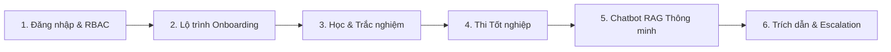

# 🚗 HƯỚNG DẪN DEMO HỆ THỐNG VF AI ONBOARDING & OPERATIONAL SUPPORT
**Dự án:** Trợ lý AI Hội nhập và Hỗ trợ Nghiệp vụ Tác nghiệp Đại lý VinFast  
**Đội ngũ:** Team The Sigmoid — AI Thực chiến VinUni  

---

## 📌 I. TỔNG QUAN DỰ ÁN & GIÁ TRỊ MANG LẠI (1–2 PHÚT MỞ ĐẦU)

### 1. Bối cảnh & Vấn đề thực tế tại đại lý VinFast:
- **Tài liệu nghiệp vụ đồ sộ và đa định dạng:** DOCX, PDF, PPTX, XLSX, video hướng dẫn tác nghiệp kỹ thuật (MP4).
- **Thời gian đào tạo nhân sự mới (Onboarding) kéo dài:** Nhân viên mới (Sale, KTV, Kế toán) mất từ 2–4 tuần để nắm bắt quy trình và hệ thống DMS.
- **Sai sót trong tác nghiệp:** Sai sót trong thủ tục thu hồi pin, xuất hóa đơn, kiểm tra bảo hành hoặc thao tác sai trên DMS gây gián đoạn quy trình.

### 2. Giải pháp của Team The Sigmoid:
- **Track 1 — Pipeline Xử lý Dữ liệu Tự động (ETL & Ingestion):**
  - Trích xuất tự động văn bản, bảng biểu, hình ảnh và âm thanh từ video (Whisper STT).
  - Chuẩn hóa Markdown, phân đoạn thông minh (Structure-Aware Chunker) và lưu trữ trên **MinIO**.
  - Xây dựng cơ sở dữ liệu Vector (**ChromaDB**) kết hợp **BM25 Hybrid Search**.
- **Track 2 — Hệ thống Multi-Agent RAG & Nền tảng Onboarding:**
  - Phân quyền dữ liệu theo vai trò (**RBAC**): Kế toán, Tư vấn bán hàng, Kỹ thuật viên, Chủ đại lý.
  - Lộ trình Onboarding tương tác: Xem tài liệu, video, bài tập tình huống thực tế và **Bài thi tốt nghiệp (Graduation Exam)**.
  - **Trợ lý AI Tác nghiệp 24/7:** Trả lời chính xác, trích dẫn số trang/tên file nguồn, tự động tạo phiếu hỗ trợ (Escalation) khi vượt quá phạm vi tài liệu.

---

## 🔑 II. DANH SÁCH TÀI KHOẢN DEMO (PRE-SEEDED ACCOUNTS)

Mật khẩu chung cho tất cả tài khoản: `123456`

| Vai trò (Role) | Email đăng nhập | Tên hiển thị | Phạm vi nghiệp vụ |
| :--- | :--- | :--- | :--- |
| **Kế toán (Accountant)** | `ketoan@vinfast.vn` | Kế toán viên | Hóa đơn, thanh lý hợp đồng thuê pin, xuất phiếu thu chi |
| **Kỹ thuật viên (Technician)** | `ktv@vinfast.vn` | Kỹ thuật viên | Tháo lắp pin, chẩn đoán lỗi, quy trình bảo dưỡng xe máy/ô tô điện |
| **Tư vấn bán hàng (Sales)** | `sale@vinfast.vn` | Tư vấn bán hàng | Chính sách giá, ưu đãi 600K, bảng so sánh xe điện - xe xăng |
| **Chủ đại lý (Owner)** | `owner@vinfast.vn` | Quản trị Đại lý | Toàn quyền xem lộ trình, gửi lời mời nhân viên mới |

---

## 🎬 III. KỊCH BẢN DEMO CHI TIẾT (6 BƯỚC THỰC HIỆN)

---

### BƯỚC 1: ĐĂNG NHẬP & PHÂN QUYỀN VAI TRÒ (RBAC)
1. Truy cập vào giao diện web (hoặc link ngrok).
2. Tại màn hình **Đăng nhập**, bấm chọn nhanh tài khoản **Kế toán** (`ketoan@vinfast.vn`).
3. **Điểm nhấn thuyết trình cho Mentor:**
   - Hệ thống tự động nhận diện Role và tải đúng lộ trình đào tạo riêng biệt của Kế toán.
   - Giao diện thiết kế theo chuẩn Brand Identity VinFast (Xanh lá - Trắng), tối ưu font chữ tiếng Việt (**Be Vietnam Pro** cho Heading & **Inter** cho Body text).

---

### BƯỚC 2: TRẢI NGHIỆM LỘ TRÌNH HỘI NHẬP (ONBOARDING JOURNEY)
1. Xem thẻ **Tiến độ học tập** (Biểu đồ tròn phần trăm hoàn thành động).
2. Xem danh sách các bài học:
   - Các bài học được thiết kế tuần tự (Step-by-step locking mechanism).
   - Bài học chưa tới lượt sẽ bị khoá `🔒 Khoá` để đảm bảo nhân viên học có lộ trình.
3. Bấm vào bài học **"Quy trình thanh lý hợp đồng thuê pin và xuất hóa đơn"**:
   - Giao diện chi tiết hiển thị: **Mục tiêu bài học (🎯)**, **Nội dung hướng dẫn từng bước**, và **Tài liệu đính kèm**.
   - Bấm nút **"Xem"** trên tài liệu để mở trực tiếp tài liệu gốc/video hướng dẫn mà không cần tải về máy.

---

### BƯỚC 3: TRẮC NGHIỆM TÌNH HUỐNG THỰC TẾ
1. Trong màn hình chi tiết bài học, kéo xuống nút **"Trắc nghiệm tình huống"** (nút xanh lá nổi bật).
2. Bấm vào nút để mở **Quiz Modal**:
   - Trả lời các câu hỏi tình huống nghiệp vụ thực tế.
   - Khi chọn đáp án và nộp bài, hệ thống hiển thị giải thích chi tiết vì sao đúng/sai theo chuẩn quy trình VinFast.
3. Khi hoàn thành bài học, tiến độ ngoài trang chủ tự động tăng lên và mở khoá bài học tiếp theo.

---

### BƯỚC 4: BÀI KIỂM TRA TỐT NGHIỆP & CHỨNG NHẬN (FINAL EXAM)
1. Khi hoàn thành tất cả các bài học (100% tiến độ):
   - Thẻ **"Bài kiểm tra tốt nghiệp"** ở cuối trang sẽ chuyển từ trạng thái `🔒 Khoá` sang `🎓 Sẵn sàng thi!`.
2. Bấm nút **"Thi ngay 🎓"**:
   - Hệ thống tổng hợp bộ câu hỏi trắc nghiệm toàn diện các nghiệp vụ trọng tâm.
   - Đạt kết quả sẽ nhận ngay danh hiệu: **"🏆 Chứng nhận tốt nghiệp Onboarding - 🎖️ Đã đạt"**.

---

### BƯỚC 5: TEST TRỢ LÝ AI AGENT (RAG + PHÂN QUYỀN TÀI LIỆU)
Mở cửa sổ **VF AI Assistant** (Góc phải màn hình) để thực hiện các câu hỏi demo:

#### 🔹 Câu hỏi 1 (Đúng vai trò Kế toán):
- **Câu hỏi:** *"Quy trình tạo lệnh sửa chữa RO khi thanh lý hợp đồng thuê pin xe điện thực hiện thế nào?"*
- **Kỳ vọng:** AI trích xuất chính xác quy trình 4 bước từ tài liệu `VF_HDSD_Thanh lý chấm dứt, đổi chủ, kích hoạt lại HĐTP dòng xe đổi Pin.docx`.
- **Trích dẫn nguồn:** Hiển thị rõ tên file tài liệu tham khảo kèm trích dẫn văn bản liên quan.

#### 🔹 Câu hỏi 2 (Kiểm tra Phân quyền RBAC):
- **Câu hỏi:** *"Quy trình chi tiết tháo lắp pack pin cao áp xe ô tô điện VF8?"*
- **Kỳ vọng:** Khi đang ở vai trò Kế toán, AI nhận diện đây là nghiệp vụ chuyên sâu của Kỹ thuật viên (KTV) và nhắc nhở đúng quyền hạn nghiệp vụ:
  > *"Với vai trò Kế toán, tài liệu nghiệp vụ của bạn tập trung vào quản lý hợp đồng và hóa đơn pin trên DMS. Quy trình kỹ thuật tháo dỡ pack pin vật lý thuộc phạm vi tài liệu của Kỹ thuật viên."*

#### 🔹 Câu hỏi 3 (Đăng nhập vai trò Kỹ thuật viên để so sánh):
- Đăng xuất -> Đăng nhập tài khoản `ktv@vinfast.vn`.
- Hỏi lại câu hỏi tháo lắp pin: AI sẽ trả lời chi tiết các bước kỹ thuật an toàn điện cao áp theo đúng tài liệu KTV!

#### 🔹 Câu hỏi 4 (Chính sách kinh doanh & Bán hàng):
- Đăng nhập `sale@vinfast.vn`.
- **Câu hỏi:** *"Khách hàng mua xe máy điện thì được hưởng ưu đãi chăm sóc xe 600k như thế nào?"*
- **Kỳ vọng:** AI trả lời chính xác đối tượng, thời hạn và quy trình áp dụng voucher chăm sóc xe 600.000đ từ tài liệu Sale.

---

### BƯỚC 6: TÍNH NĂNG NÂNG CAO — ESCALATION & TẠO PHIẾU HỖ TRỢ
1. Đặt câu hỏi nằm ngoài phạm vi tài liệu hoặc cần hỗ trợ từ cấp quản lý:
   - **Câu hỏi:** *"Trường hợp khách hàng yêu cầu hoàn tiền đặc biệt ngoài chính sách đại lý thì xử lý ra sao?"*
2. **Kỳ vọng AI Agent:**
   - Nhận diện câu hỏi cần escalated (`needs_escalation = true`).
   - Cung cấp nút **"Tạo phiếu yêu cầu hỗ trợ (Escalate Ticket)"** chuyển tiếp trực tiếp cho Quản lý / Giám đốc đại lý.

---

## 🛠️ IV. KIẾN TRÚC KỸ THUẬT NỔI BẬT (ĐỂ TRẢ LỜI CÂU HỎI CỦA MENTOR)

1. **Pipeline Xử lý Đa Phương tiện (Track 1):**
   - Hỗ trợ trích xuất văn bản có cấu trúc từ PDF, DOCX, XLSX, PPTX.
   - Nhận dạng giọng nói tiếng Việt từ video huấn luyện bằng **Whisper STT** gắn timestamp.
   - Hợp nhất các phân đoạn ngắn thành chunk mạch lạc (300–600 tokens) giúp tăng độ chính xác Semantic Search.

2. **Cơ chế Hybrid Search & Reranking:**
   - Kết hợp **Dense Retrieval (ChromaDB Vector Embeddings)** và **Sparse Retrieval (BM25 Lexical Keyword Search)** theo thuật toán Reciprocal Rank Fusion (RRF).
   - Đảm bảo tìm chính xác cả thuật ngữ viết tắt nội bộ (DMS, RO, HĐTP, CCCD) lẫn ngữ nghĩa câu hỏi.

3. **Bảo mật & Phân quyền Dữ liệu (Strict Multi-Tenant RBAC):**
   - Metadata tagging theo vai trò: `accounting`, `sales`, `technician`, `owner`.
   - Vector Store tự động filter metadata trước khi đưa vào ngữ cảnh LLM, loại bỏ hoàn toàn rủi ro rò rỉ tài liệu giữa các bộ phận.

4. **Tối ưu Trải nghiệm Frontend:**
   - 100% Single-Page Architecture mượt mà (React 19 + TypeScript + Vite).
   - Thiết kế chuẩn Responsive, hỗ trợ Demo mượt mà qua **ngrok** trên mọi thiết bị máy tính, tablet và mobile.

---

## 📋 V. CHECKLIST TRƯỚC GIỜ DEMO

- [ ] **Docker Containers đang chạy:** PostgreSQL, MinIO (`docker compose ps`).
- [ ] **Backend Server đang chạy:** `python -m uvicorn src.main:app --port 8001 --reload`.
- [ ] **Frontend Dev Server đang chạy:** `npm run dev` (Port 5173).
- [ ] **Ngrok Tunnel sẵn sàng:** `ngrok http 5173`.
- [ ] **Dữ liệu Vector DB:** Đã index 182 chunks + 56 tài liệu chuẩn hóa vào ChromaDB.

---
*Chúc Team The Sigmoid có buổi báo cáo và demo xuất sắc trước Ban Giám khảo & Mentor! 🚀*
