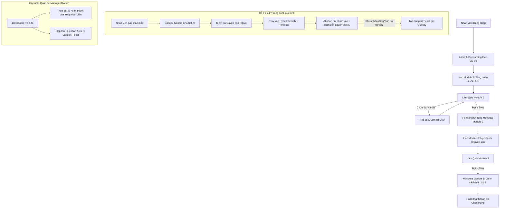

# BÁO CÁO TỔNG QUAN LOGIC DỰ ÁN
## HỆ THỐNG ONBOARDING & TRỢ LÝ AI HỖ TRỢ VẬN HÀNH ĐẠI LÝ XE MÁY ĐIỆN VINFAST
*(VF AI Onboarding & Operations Assistant)*

---

## 🎯 1. TỔNG QUAN & BÀI TOÁN KINH DOANH (Executive Summary)

### 📌 Thách thức hiện tại:
* **Khối lượng tài liệu lớn & phân tán**: Hơn 50+ tài liệu đa định dạng (PDF, Word, PowerPoint, Video hướng dẫn) với hàng trăm quy trình phức tạp: Bán hàng, xuất hóa đơn DMS, ghép xe/ghép pin, xử lý claim, chẩn đoán khối pin LFP, bảo dưỡng kỹ thuật 3S,...
* **Tốn thời gian & chi phí đào tạo**: Đào tạo nhân viên mới mất nhiều tuần và phụ thuộc hoàn toàn vào nhân sự cấp quản lý hướng dẫn thủ công.
* **Sai sót trong thực thi & tra cứu chậm**: Nhân viên khó nhớ hết các chính sách khuyến mãi và quy định bảo hành mới nhất, dễ dẫn đến khiếu nại của khách hàng hoặc chậm trễ xử lý đơn hàng.

### 💡 Giải pháp của Dự án:
Xây dựng **Nền tảng số hoá Đào tạo tích hợp Trợ lý Trí tuệ nhân tạo (AI RAG Agent)**:
1. **Lộ trình học tập cá nhân hóa theo vai trò** (Sales, Kế toán, Kỹ thuật viên, Chủ đại lý).
2. **Kiểm soát chất lượng đào tạo tự động** qua các bài kiểm tra (Quiz Gateways).
3. **Trợ lý AI giải đáp thắc mắc 24/7**, tra cứu tức thì quy trình nội bộ với độ chính xác cao và trích dẫn nguồn tài liệu chuẩn xác.

---

## 🏗️ 2. BA TRỤ CỘT HOẠT ĐỘNG CỐT LÕI (Core Pillars)

```
┌─────────────────────────────────────────────────────────────────────────┐
│              KIẾN TRÚC TỔNG THỂ HỆ THỐNG (3 TRỤ CỘT)                    │
├──────────────────┬──────────────────────────┬───────────────────────────┤
│   TRỤ CỘT 1      │        TRỤ CỘT 2         │        TRỤ CỘT 3          │
│ CHUẨN HÓA DỮ LIỆU│  ĐÀO TẠO & ĐÁNH GIÁ (LMS)│ TRỢ LÝ AI TRUY VẤN (RAG)  │
├──────────────────┼──────────────────────────┼───────────────────────────┤
│ • 54+ Tài liệu   │ • 4 Nhóm vai trò         │ • Tìm kiếm lai (Hybrid)   │
│ • Xoá sạch PII   │ • 3 Module chuẩn hóa     │ • Phân quyền dữ liệu RBAC │
│ • Cắt Chunk &    │ • Mở khoá theo Quiz ≥80% │ • Trích dẫn nguồn tài liệu│
│   Vector hoá DB  │ • Dashboard cho Quản lý  │ • Hệ thống Support Ticket │
└──────────────────┴──────────────────────────┴───────────────────────────┘
```

---

### 🔹 Trụ cột 1: Chuẩn hóa & Bảo mật Tri thức (Data Pipeline)
* **Thu thập & Chuẩn hóa**: Tự động chuyển đổi toàn bộ tài liệu PDF, DOCX, PPTX sang định dạng Markdown sạch, giữ nguyên cấu trúc bảng biểu và danh sách nghiệp vụ.
* **Bảo vệ dữ liệu nhạy cảm (PII Masking)**: Tự động phát hiện và ẩn thông tin cá nhân/nội bộ nhạy cảm (Số điện thoại, CCCD, Email cá nhân,...) trước khi nạp vào AI.
* **Lập chỉ mục thông minh**: Dữ liệu được chia thành các đoạn ngắn (chunks) và lưu đồng thời vào:
  * **Cơ sở dữ liệu Vector (ChromaDB)**: 1.167 vector chunks phục vụ hiểu ngữ nghĩa tự nhiên.
  * **Chỉ mục Từ khóa (BM25 Index)**: 198 văn bản phục vụ tìm kiếm chính xác mã sản phẩm, mã lệnh (ZVOR, RO, PIN LFP,...).

---

### 🔹 Trụ cột 2: Lộ trình Đào tạo & Kiểm soát Chất lượng (LMS & Quiz)
Hệ thống thiết kế lộ trình học tập trực quan theo từng vai trò công việc:
* **Tư vấn bán hàng (Sales)**: Quy trình 7 bước, thông số các dòng xe điện, tư vấn gói thuê pin LFP vs mua đứt pin, ưu đãi hiện hành.
* **Kế toán đại lý (Accountant)**: Vận hành hệ thống DMS, tạo PO đặt hàng, lập phiếu nhập PR, xuất hóa đơn GTGT, hồ sơ Claim NPP.
* **Kỹ thuật viên (Technician)**: Quy trình tiếp nhận xe xưởng 3S, chẩn đoán sự cố khối Pin LFP, mở lệnh sửa chữa RO, cam kết SLA.
* **Chủ / Quản lý đại lý (Owner/Manager)**: Toàn bộ lộ trình trên + Quản lý tiến độ học tập đội ngũ, phân quyền và duyệt Support Ticket.

#### 🎯 Cơ chế kiểm soát chất lượng (Quality Gate):
* Mỗi vai trò gồm **3 Module học tập**:
  1. **Module 1**: Tổng quan thương hiệu & Văn hóa hội nhập VinFast.
  2. **Module 2**: Kiến thức nghiệp vụ chuyên môn theo vai trò.
  3. **Module 3**: Chính sách, chương trình khuyến mãi & chăm sóc xe đang áp dụng.
* **Điều kiện mở khóa Module**: Nhân viên phải hoàn thành bài thi trắc nghiệm (Quiz) của Module trước với điểm số **$\ge 80\%$** mới được mở khóa Module tiếp theo.

---

### 🔹 Trụ cột 3: Trợ lý AI Thông minh & Phân quyền Truy cập (RAG & RBAC)
* **Phân quyền dữ liệu (Role-Based Access Control)**:
  * *Nhân viên Bán hàng* chỉ truy vấn được tài liệu bán hàng, thông số xe, giá và khuyến mãi.
  * *Kỹ thuật viên* chỉ truy vấn quy trình kỹ thuật, mã lỗi, bảo hành pin.
  * *Kế toán* chỉ truy vấn quy trình chứng từ, DMS, hóa đơn.
  * *Chủ đại lý* có quyền tra cứu toàn bộ tài liệu hệ thống.
* **Công nghệ Tìm kiếm Lai (Hybrid Search + Cross-Encoder Reranker)**:
  * Kết hợp điểm tương đồng ngữ nghĩa (Vector) và điểm từ khóa (BM25) qua thuật toán RRF.
  * Mô hình Cross-Encoder đánh giá lại top văn bản phù hợp nhất trước khi đưa vào mô hình ngôn ngữ lớn (LLM).
* **Độ chính xác cao & Minh bạch**:
  * AI trả lời câu hỏi **dựa trên 100% dữ liệu thực tế** của VinFast, kèm ghi chú rõ tên tài liệu gốc làm nguồn đối chứng (Citations).
  * Tích hợp tính năng gửi **Support Ticket** về Quản lý khi gặp các trường hợp cần can thiệp ngoại lệ.

---

## 🔄 3. LUỒNG TRẢI NGHIỆM NGƯỜI DÙNG (End-to-End Workflow)



---

## 📈 4. GIÁ TRỊ VÀ HIỆU QUẢ ĐẠT ĐƯỢC (Business Value & ROI)

| Chỉ số | Trước khi triển khai | Sau khi triển khai Hệ thống |
| :--- | :--- | :--- |
| **Thời gian Onboarding nhân sự mới** | 2 - 3 tuần đào tạo thủ công | **3 - 5 ngày** tự học có kiểm tra đánh giá |
| **Tốc độ tra cứu quy trình/chính sách** | Mất 15 - 30 phút tìm văn bản hoặc hỏi quản lý | **Dưới 3 giây** với Trợ lý AI |
| **Mức độ chuẩn hóa quy trình** | Phụ thuộc người hướng dẫn (dễ sai lệch) | **100% đồng bộ** theo tiêu chuẩn VinFast |
| **Khả năng giám sát của Ban quản lý** | Khó theo dõi tiến độ nhân viên mới | **Thời gian thực (Real-time)** qua Dashboard |
| **Tính bảo mật thông tin nội bộ** | Dễ rò rỉ dữ liệu khi chia sẻ file qua chat | **Kiểm soát chặt chẽ** qua phân quyền vai trò (RBAC) |

---

## 🚀 5. TỔNG KẾT
Hệ thống là giải pháp **toàn diện, hiện đại và sẵn sàng mở rộng**, giúp đại lý xe máy điện VinFast tối ưu hóa chi phí vận hành, nâng cao chất lượng nhân sự ngay từ ngày đầu làm việc và đảm bảo sự hài lòng tối đa cho khách hàng.
