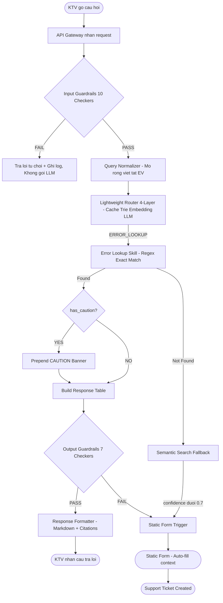

# MVP SPECIFICATION — VF-Onboarding Copilot
## Tổng quan Toàn dự án (Master Overview)

| Trường | Nội dung |
| :--- | :--- |
| **Mã tài liệu** | MVP-SPEC-VF-ONBOARDING-2026-V1 |
| **Phiên bản** | 1.0.0 |
| **Dự án** | VF-Onboarding Copilot Platform |
| **Ngày phát hành** | 09/08/2026 |
| **Trạng thái** | ✅ Approved for Engineering |
| **Tham chiếu** | PRD-VF-ONBOARDING-2026-V3 · SPEC-VF-ONBOARDING-2026-V5 · SPEC-PRODUCT-V2 |

### Nhóm Thực Hiện — Team T223

| Vai trò | Thành viên | Trách nhiệm MVP |
| :--- | :--- | :--- |
| **Product Owner (PO)** | Lương Quỳnh Chi | User Stories, Golden Test Set, Domain Knowledge, UAT |
| **Project Manager (PM)** | Phạm Tiến Hưng | Sprint Planning, KPIs, Acceptance Criteria, Progress Tracking |
| **System Architect / Tech Lead** | Nguyễn Duy Thái | System Architecture, Router, Backend Core, RAG Engine |
| **Dev Lead / AI Engineer** | Sẻ Thế Hưng | Skill Modules, UI/UX, Database, API Integration, Deployment |

---

## 1. Tổng quan Bài toán

### 1.1. Vấn đề cần giải quyết (Problem Statement)

Kỹ thuật viên (KTV) tại các Đại lý Phân phối (DLPP) xe máy điện VinFast, đặc biệt là nhân viên mới, gặp nhiều khó khăn nghiêm trọng trong công việc hàng ngày:

- **Tra cứu thủ công tốn thời gian:** Mỗi lần cần hỏi về quy trình, mã lỗi hay chính sách, KTV phải dừng công việc, tra tìm trong hàng chục file PDF/Excel, mất 10-30 phút cho một tra cứu đơn giản.
- **Kênh hỗ trợ thủ công gây gián đoạn:** Việc hỏi đáp qua tin nhắn/điện thoại tới Quản lý xưởng hoặc IT Admin gây gián đoạn dây chuyền, kéo dài thời gian sửa chữa.
- **Rủi ro an toàn lao động:** KTV có thể thao tác sai quy chuẩn hệ thống điện cao áp (pin LFP, BMS) do thiếu hướng dẫn an toàn tức thì.
- **Onboarding KTV mới chậm:** Trung bình mất 5 ngày để KTV mới có thể tự tin thực hiện công việc độc lập.

### 1.2. Giải pháp MVP (Solution)

**VF-Onboarding Copilot** là trợ lý AI hội thoại (AI Chatbot) được nhúng vào môi trường làm việc của DLPP, cho phép KTV, Tổ trưởng và Quản lý xưởng:
- Tra cứu quy trình kỹ thuật tức thì bằng tiếng Việt.
- Được hướng dẫn an toàn tự động khi gặp mã lỗi điện cao áp.
- Tự động leo thang hỗ trợ khi AI không đủ thông tin, không bao giờ để "im lặng" hay "bịa đặt".

### 1.3. Giá trị mang lại (Value Proposition)

| Chỉ số | Hiện tại | Mục tiêu MVP |
| :--- | :--- | :--- |
| Thời gian tra cứu kỹ thuật | 10-30 phút | **dưới 3 giây** |
| Thời gian Onboarding KTV mới | 5 ngày | **dưới 2 ngày (giảm 50%)** |
| Tỷ lệ giải quyết ngay lần đầu (FCR) | Baseline | **+40%** |
| Rủi ro thao tác sai an toàn điện | Cao (không cảnh báo tức thì) | **Bằng 0 (auto CAUTION banner)** |

---

## 2. Phạm vi MVP (Scope & Out-of-Scope)

### 2.1. IN SCOPE — Phase 1 MVP

| Tính năng | Mô tả ngắn |
| :--- | :--- |
| **Workflow Guidance** | Hướng dẫn quy trình từng bước (PDI, bảo dưỡng), nội dung tĩnh, phản hồi dưới 50ms |
| **Policy Copilot (RAG)** | Tra cứu chính sách/nghiệp vụ từ tài liệu, trả lời kèm trích dẫn nguồn |
| **Error Code Lookup** | Tra cứu mã lỗi DTC, tự động CAUTION banner cho lỗi điện cao áp |
| **Static Form / Escalation** | Tự động chuyển giao Support Ticket khi AI không đủ tự tin |
| **Multi-layer Guardrails** | 10 Input Checkers + 7 Output Checkers bảo vệ toàn hệ thống |
| **RBAC (Phân quyền)** | 4 vai trò: technician, lead_tech, service_manager, it_admin |
| **Lightweight Router** | 4 tầng định tuyến thông minh: Cache → Từ khóa → Ngữ nghĩa → AI, tối thiểu chi phí |
| **Ingestion Pipeline** | Nạp tài liệu PDF/DOCX/Excel vào Knowledge Base (chạy offline, không ảnh hưởng runtime) |
| **Hybrid Search** | Tìm kiếm kết hợp: Từ khóa chính xác + Ngữ nghĩa + Xếp hạng lại theo độ liên quan |
| **Observability** | Ghi log có cấu trúc, trace ID theo phiên, audit log sự kiện bảo mật |

### 2.2. OUT OF SCOPE — Phase 2

| Tính năng | Lý do hoãn |
| :--- | :--- |
| Voice AI (STT/TTS, Voice Cloning) | Cần hạ tầng phức tạp hơn |
| OCR / QR Code / Image Understanding | Phụ thuộc hardware camera tại DLPP |
| Advanced Memory / History-Augmented RAG | Phase 1 đủ với session context |
| Dashboard & Analytics | Cần dữ liệu vận hành thực tế trước |
| Multi-Agent Orchestration | Kiến trúc Phase 1 đủ mạnh |
| Sales / Pricing Module | Scope khác, người dùng khác |
| Manager Dashboard | Out of scope Phase 1 |
| Offline Mode (Web App nội bộ + AI cục bộ) | Không cần cho môi trường DLPP có WiFi |
| JWT Authentication | Phase 1 tin tưởng request field (môi trường nội bộ) |
| DMS Integration | Không kết nối trực tiếp hệ thống quản lý đại lý |

### 2.3. Anti-Goals (Tuyệt đối không làm trong MVP)

1. **KHÔNG** tự động cấu hình/thay đổi phần cứng xe điện.
2. **KHÔNG** trả lời tự do ngoài tài liệu đã được kiểm duyệt (Zero-shot knowledge).
3. **KHÔNG** hỗ trợ ngôn ngữ khác tiếng Việt.
4. **KHÔNG** kết nối DMS real-time (tồn kho, giá bán).
5. **KHÔNG** ghi đè/sửa dữ liệu gốc trong Knowledge Base khi đang vận hành.

---

## 3. Đối tượng Người dùng & Phân quyền (Personas & RBAC)

### 3.1. Bản đồ Personas

```
+------------------------------------------------------------------+
|                    USER PERSONAS & ACCESS                         |
|                                                                    |
|  [Technician]  -->  PDI, Bao duong, Ma loi co ban               |
|                     (X) Chinh sach tai chinh, quan ly xuong      |
|                                                                    |
|  [Lead Tech]   -->  Ky thuat nang cao, bao hanh cap 1           |
|                     (X) Bao cao tai chinh, nhan su               |
|                                                                    |
|  [Service Mgr] -->  Toan bo dich vu ky thuat + chinh sach        |
|                     (X) Quan tri he thong IT nang cao             |
|                                                                    |
|  [IT Admin]    -->  Toan quyen + Tiep nhan Support Ticket        |
|                     (OK) Giam sat he thong AI                    |
+------------------------------------------------------------------+
```

### 3.2. RBAC Hierarchy

```
it_admin:        [technician, lead_tech, service_manager, it_admin, public]
service_manager: [technician, lead_tech, service_manager, public]
lead_tech:       [technician, lead_tech, public]
technician:      [technician, public]
```

> **Nguyên tắc:** Cấp cao hơn kế thừa toàn bộ quyền cấp dưới. Fail-safe: role không hợp lệ mặc định "technician" (thấp nhất).

---

## 4. Tính năng Cốt lõi (Core Features) & User Stories

### 4.1. Feature FR-01: Workflow Guidance (Hướng dẫn Quy trình Tĩnh)

**User Story:**
> Là một Kỹ thuật viên mới, tôi muốn xem checklist quy trình PDI cho xe Klara S để có thể thực hiện kiểm tra đúng chuẩn mà không cần phải mở file PDF.

**Acceptance Criteria (Given/When/Then):**

| ID | Given | When | Then |
| :--- | :--- | :--- | :--- |
| AC-01.1 | KTV gõ "quy trình PDI xe Klara S" | Hệ thống nhận yêu cầu | Trả về checklist markdown từng bước, thời gian ước tính, trong dưới 50ms, không qua LLM |
| AC-01.2 | Quy trình có has_caution=True (liên quan điện cao áp) | Người dùng mở quy trình | Tự động chèn CAUTION banner màu đỏ ở đầu câu trả lời |
| AC-01.3 | Technician yêu cầu quy trình chỉ dành cho service_manager | Hệ thống kiểm tra phân quyền | Từ chối, hiển thị "Bạn không có quyền xem quy trình này." |
| AC-01.4 | Người dùng truy cập quy trình không tồn tại | Hệ thống tìm kiếm | Hiển thị danh sách quy trình khả dụng theo role, không báo lỗi 500 |

---

### 4.2. Feature FR-02: Policy Copilot RAG (Tra cứu Chính sách)

**User Story:**
> Là Service Manager, tôi muốn hỏi câu hỏi tự nhiên về chính sách bảo hành pin LFP để trả lời khách hàng nhanh chóng và chính xác, kèm nguồn tài liệu để đối chiếu.

**Acceptance Criteria:**

| ID | Given | When | Then |
| :--- | :--- | :--- | :--- |
| AC-02.1 | Service Manager hỏi "Chính sách bảo hành pin LFP bao lâu?" | Hệ thống xử lý | Tìm trong kho tài liệu của role service_manager, trả lời kèm trích dẫn [1] Warranty_Policy_2026.docx — Trang 5 |
| AC-02.2 | Câu hỏi không có trong kho tài liệu (confidence dưới 0.70) | Hệ thống tổng hợp kết quả | Thông báo không tìm thấy, KHÔNG tự suy đoán, tự động chuyển sang Static Form |
| AC-02.3 | Technician hỏi về tài liệu chỉ dành cho service_manager | Hệ thống kiểm tra phân quyền tại tầng Knowledge Base | Không trả về thông tin vượt quyền |
| AC-02.4 | Mọi câu trả lời RAG được tạo ra | Hệ thống output guardrail kiểm tra | 100% câu trả lời có ít nhất 1 trích dẫn nguồn; nếu thiếu thì hủy và escalate |

---

### 4.3. Feature FR-03: Error Code Lookup (Tra cứu Mã lỗi DTC)

**User Story:**
> Là một Kỹ thuật viên, khi xe báo lỗi BMS_OVERHEAT, tôi muốn biết ngay nguyên nhân, cảnh báo an toàn và các bước xử lý cụ thể để không thao tác sai gây nguy hiểm.

**Acceptance Criteria:**

| ID | Given | When | Then |
| :--- | :--- | :--- | :--- |
| AC-03.1 | KTV gõ "xe báo lỗi BMS_OVERHEAT xử lý thế nào?" | Hệ thống nhận diện mã lỗi | Trích xuất mã, tra cứu exact match, trả về bảng: Mô tả, Nguyên nhân, Các bước xử lý, Thời gian, Linh kiện, Nguồn |
| AC-03.2 | Mã lỗi thuộc nhóm điện cao áp (BMS_OVERHEAT, P0A80...) | Hệ thống xuất câu trả lời | Bắt buộc chèn CAUTION banner màu đỏ ở đầu, kèm chỉ dẫn an toàn |
| AC-03.3 | KTV nhập mã lỗi không tồn tại trong hệ thống | Hệ thống tìm kiếm | Hiển thị thông báo không tìm thấy, đề xuất tạo Support Ticket |
| AC-03.4 | KTV mô tả triệu chứng không có mã cụ thể | Hệ thống xử lý | Dùng semantic search fallback, gợi ý 3-5 mã lỗi có thể liên quan |
| AC-03.5 | Tra cứu chính xác mã lỗi tìm thấy trong hệ thống | Hệ thống truy xuất | Phải trả kết quả trong dưới 200ms |

---

### 4.4. Feature FR-04: Static Form / Human Escalation (Hỗ trợ Thủ công)

**User Story:**
> Là một Kỹ thuật viên, khi AI không giải quyết được vấn đề của tôi, tôi muốn gửi yêu cầu hỗ trợ thủ công nhanh chóng và không cần nhập lại thông tin đã mô tả.

**Acceptance Criteria:**

| ID | Given | When | Then |
| :--- | :--- | :--- | :--- |
| AC-04.1 | AI confidence dưới 0.70 hoặc RAG không tìm thấy | Hệ thống tổng hợp | Hiển thị biểu mẫu Static Form, điền sẵn câu hỏi gốc, mã lỗi (nếu có), tóm tắt chat |
| AC-04.2 | Người dùng hoàn tất và bấm Gửi biểu mẫu | Hệ thống xử lý | Tạo Ticket với mã TCK-YYYYMMDD-XXXXXX, lưu DB, hiển thị xác nhận |
| AC-04.3 | Ticket liên quan đến lỗi điện cao áp | Hệ thống phân loại ưu tiên | Gán priority=urgent tự động |
| AC-04.4 | Ticket liên quan đến mã lỗi nghiêm trọng | Hệ thống phân loại | Gán priority=high |
| AC-04.5 | IT Admin đăng nhập hệ thống | Giao diện quản trị | Xem danh sách Ticket, cập nhật trạng thái: New → In Progress → Closed |

---

### 4.5. Feature FR-05: Guardrails & Security (Bảo vệ An toàn Hệ thống)

**User Story:**
> Là IT Admin, tôi cần đảm bảo không có người dùng nào có thể tấn công hoặc lợi dụng AI để lộ dữ liệu, hoặc nhận câu trả lời sai lệch gây hại.

**Acceptance Criteria:**

| ID | Given | When | Then |
| :--- | :--- | :--- | :--- |
| AC-05.1 | Người dùng gửi câu hỏi có chứa SĐT, CMND, VIN | Câu hỏi qua Input Guardrail GRD-07 | PII tự động được mask thành [PHONE_MASKED], [CMND_MASKED], [VIN_MASKED] trước khi vào log/LLM |
| AC-05.2 | Người dùng thử Prompt Injection | GRD-04 xử lý | Chặn ngay, ghi log PROMPT_INJECTION, trả lời từ chối lịch sự, không gọi LLM |
| AC-05.3 | Người dùng gửi câu hỏi ngoài phạm vi (nấu ăn, thể thao...) | GRD-06 xử lý | Từ chối, hiển thị "Tôi chỉ hỗ trợ nghiệp vụ xe máy điện VinFast." |
| AC-05.4 | RAG tạo ra câu trả lời không có trích dẫn | Output Guardrail OUT-01 | Hủy câu trả lời, kích hoạt escalation |
| AC-05.5 | Spam: hơn 20 request/phút từ 1 session | GRD-09 | Trả về HTTP 429, chặn 1 phút |

---

## 5. Luồng Hoạt động Chính (User Flow)

### 5.1. Luồng Happy Path — Tra cứu Mã lỗi



### 5.2. Luồng Tổng quan Pipeline (Text)

```
USER INPUT
    |
    v
[INPUT GUARDRAILS 10 checkers] --FAIL--> Reject + Log (HTTP 400/429)
    | PASS
    v
[QUERY NORMALIZER] -- Abbreviation expand, role context
    |
    v
[LIGHTWEIGHT ROUTER 4 layers]
    |-- L1 Cache (<1ms)      --HIT--> [SKILL]
    |-- L2 Trie (<10ms)      --conf>=0.90--> [SKILL]
    |-- L3 Embedding (<80ms) --conf>=0.85--> [SKILL]
    |-- L4 LLM (~3%)         ---------> [SKILL]
    |
    v
[SKILL ROUTING]
    |-- WORKFLOW     --> Static Template (50ms, no LLM)
    |-- RAG_POLICY   --> Hybrid Search + LLM Generate
    |-- ERROR_LOOKUP --> Regex Match + Semantic Fallback
    |-- STATIC_FORM  --> Form Payload + Ticket Create
    |
    v
[OUTPUT GUARDRAILS 7 checkers] --FAIL--> Escalate to Ticket
    | PASS
    v
[RESPONSE FORMATTER] -- Markdown, Citations, CAUTION banner
    |
    v
USER RESPONSE
```

---

## 6. Phân rã Công việc (WBS) & Phân công theo Vai trò

### 6.1. WBS Level 1 — Nhóm công việc chính

```
MVP VF-Onboarding Copilot
|-- WBS-01: Ha tang & Moi truong
|-- WBS-02: Data & Ingestion Pipeline
|-- WBS-03: Core Runtime Engine
|   |-- WBS-03.1: Authentication & RBAC
|   |-- WBS-03.2: Input Guardrails (10 checkers)
|   |-- WBS-03.3: Query Normalizer
|   |-- WBS-03.4: Lightweight Router (4-layer)
|   |-- WBS-03.5: Orchestration Engine (điều phối luồng xử lý)
|-- WBS-04: Skill Modules
|   |-- WBS-04.1: Workflow Skill
|   |-- WBS-04.2: Policy Copilot Skill (RAG)
|   |-- WBS-04.3: Error Lookup Skill
|   |-- WBS-04.4: Static Form / Ticket Skill
|-- WBS-05: Retrieval Pipeline (Hybrid Search)
|-- WBS-06: LLM Integration & Output Guardrails
|-- WBS-07: Frontend / UI
|-- WBS-08: Testing & QA
|-- WBS-09: Deployment & Go-live
```

### 6.2. Ma trận Phân công RACI

| Công việc | PM (Hưng) | PO (Chi) | Tech Lead (Thái) | Dev Lead (Hưng S) |
| :--- | :---: | :---: | :---: | :---: |
| WBS-01 Sprint planning, Kanban setup | **R/A** | C | I | I |
| WBS-02 Thu thập & gán nhãn tài liệu | I | **R/A** | C | I |
| WBS-02 Ingestion Pipeline code | I | C | **R/A** | I |
| WBS-03.1 RBAC Middleware | A | I | **R** | C |
| WBS-03.2 Input Guardrails (10 checkers) | A | C | **R** | I |
| WBS-03.3 Query Normalizer + EV Dict | R/A | C | **R** | I |
| WBS-03.4 Lightweight Router (4-layer) | A | C | **R** | I |
| WBS-03.5 Orchestration Engine | A | I | **R** | C |
| WBS-04.1 Workflow Skill templates | C | **R/A** | I | C |
| WBS-04.2 Policy Copilot RAG Skill | A | C | **R** | C |
| WBS-04.3 Error Lookup Skill | A | R (data) | **R** (code) | I |
| WBS-04.4 Static Form / Ticket Skill | A | C | I | **R** |
| WBS-05 Hybrid Search Pipeline | A | I | **R** | C |
| WBS-06 LLM Integration + Output Guardrails | A | I | **R** | C |
| WBS-07 Chat UI, Citations, CAUTION UI | A | R (UAT) | I | **R** (code) |
| WBS-07 Static Form Modal UI | A | C | I | **R** |
| WBS-08 Test cases, Golden Set 30 queries | A | **R** | C | C |
| WBS-08 Unit tests, Integration tests | I | C | **R** | **R** |
| WBS-09 Backend Deploy (Render.com) | A | I | C | **R** |
| WBS-09 Frontend Deploy (Vercel) | A | I | I | **R** |

> **Chú thích RACI:** R = Responsible (thực hiện), A = Accountable (chịu trách nhiệm), C = Consulted (được hỏi ý kiến), I = Informed (được thông báo)

---

## 7. Kế hoạch Chia Phase (Phasing Plan)

### Phase 1 — MVP (8 ngày làm việc)

| Ngày | Sprint Goal | Deliverable chính |
| :--- | :--- | :--- |
| Ngày 1 | Kickoff, Setup môi trường, Thu thập dữ liệu | Repo init, Kanban board, Tài liệu raw DLPP |
| Ngày 2 | Ingestion Pipeline + API skeleton | Knowledge Base 2 bộ tài liệu, API nhận chat chạy được |
| Ngày 3 | Lightweight Router 4-layer hoàn chỉnh | Router accuracy >= 90%, latency < 100ms |
| Ngày 4 | RAG Policy Copilot + RBAC enforcement | RAG với citation, RBAC filter tại DB |
| Ngày 5 | Error Lookup Skill + Static Form + Ticket | Error Lookup < 200ms, Ticket flow hoàn chỉnh |
| Ngày 6 | Integration E2E + Workflow Skill | Orchestration Engine hoàn chỉnh, E2E test pass |
| Ngày 7 | QA, Bug Fix, KPI validation | Tất cả QA Gate pass |
| Ngày 8 | Deploy + Demo Day | Live URL, Video Demo, Pitch Deck |

### Phase 2 — Extension (Sau MVP, >= 30 ngày vận hành)

| Module | Điều kiện bắt đầu |
| :--- | :--- |
| Voice AI (STT/TTS) | Phase 1 ổn định, DLPP có nhu cầu voice |
| OCR / QR / Image Understanding | Pilot DLPP có thiết bị camera |
| Dashboard & Analytics | Đủ dữ liệu vận hành thực tế (>= 30 ngày) |
| Advanced Memory & History RAG | Cần optimize sau khi đo thực tế |
| Sales / Manager Module | Sau khi kỹ thuật được chấp thuận |

---

## 8. KPIs & Acceptance Criteria (Release Gate)

### 8.1. KPIs Kỹ thuật

| KPI | Target | Đo lần đầu | Đo lần cuối |
| :--- | :--- | :--- | :--- |
| Router accuracy | >= 90% / 30 golden queries | Ngày 3 | Ngày 7 |
| Router latency (Trie path) | < 10ms | Ngày 3 | Ngày 7 |
| Router latency (Embedding path) | < 80ms | Ngày 3 | Ngày 7 |
| E2E latency P95 | < 1.5s | Ngày 6 | Ngày 7 |
| RAG citation rate | 100% | Ngày 4 | Ngày 7 |
| Token savings vs LLM router | >= 60% | Ngày 6 | Ngày 7 |
| Error Lookup exact match latency | < 200ms | Ngày 5 | Ngày 7 |
| Static Form submit time | < 30s | Ngày 5 | Ngày 7 |
| Input Guardrail block rate | 10/10 attack vectors | Ngày 5 | Ngày 7 |
| RBAC cross-role leak | 0 leaks | Ngày 4 | Ngày 7 |

### 8.2. Release Gate Checklist (Ngày 7 — Phải PASS trước Deploy)

- [ ] Router accuracy >= 90% trên 30 test cases
- [ ] RAG luôn có citations (100% responses)
- [ ] RBAC: Technician KHÔNG xem được tài liệu Manager
- [ ] Error Lookup exact match < 200ms
- [ ] Static Form submit thành công, lưu DB, trả ticket_id
- [ ] 10/10 attack vectors bị chặn bởi Guardrails
- [ ] End-to-end latency < 1.5s trên máy demo
- [ ] Mobile responsive (>= 375px width)
- [ ] Hallucination rate <= 1%

---

## 9. Ma trận Rủi ro (Risk Matrix)

| ID | Rủi ro | Likelihood | Impact | Mức độ | Biện pháp Giảm thiểu |
| :--- | :--- | :---: | :---: | :---: | :--- |
| R-01 | LLM Hallucination — AI bịa thông tin kỹ thuật nguy hiểm | Trung bình | Cao | CAO | Output Guardrail bắt buộc citation, confidence threshold 0.70, auto-escalate |
| R-02 | RBAC Leak — Technician xem được dữ liệu Manager | Thấp | Rất cao | CAO | Phân quyền được kiểm soát tại tầng Knowledge Base, độc lập hoàn toàn với AI; test bắt buộc |
| R-03 | Thiếu tài liệu DLPP thực tế | Trung bình | Cao | CAO | Chuẩn bị tài liệu mẫu cấu trúc tương tự; PO (Chi) chịu trách nhiệm ngày 1-2 |
| R-04 | AI Service Downtime | Thấp | Trung bình | TRUNG BINH | Tự động chuyển sang AI Service dự phòng khi dịch vụ chính gián đoạn |
| R-05 | Mô hình hiểu tiếng Việt kém chính xác | Trung bình | Trung bình | TRUNG BINH | Mở rộng từ điển tra cứu nhanh; tăng ngưỡng kích hoạt AI dự phòng; test sớm ngày 2 |
| R-06 | Thời gian phản hồi > 1.5s trên môi trường triển khai | Thấp | Trung bình | TRUNG BINH | Cache các câu hỏi phổ biến; tính toán trước mẫu phân loại ý định |
| R-07 | Knowledge Base không ổn định khi deploy | Thấp | Trung bình | TRUNG BINH | Chuẩn bị phương án Knowledge Base dự phòng thay thế |
| R-08 | Scope creep — thêm tính năng ngoài MVP | Cao | Thấp | TRUNG BINH | Anti-goals được ghi rõ; PM từ chối mọi feature request trong sprint |
| R-09 | Độ trễ Guardrail làm chậm UX | Trung bình | Thấp | THAP | Guardrail GRD-01 đến GRD-09 < 30ms; bù đắp bằng Router Trie < 10ms |
| R-10 | PII rò rỉ qua chat log | Thấp | Cao | TRUNG BINH | GRD-07 PII Masker chạy trước mọi thao tác logging |

---

## 10. Tài liệu Tham chiếu Dự án

| Tài liệu | Mô tả | Người dùng chính |
| :--- | :--- | :--- |
| **MVP_SPEC.md** (file này) | Tổng quan dự án, WBS, RACI, KPIs, Risk Matrix | PM |
| **MVP_SPEC_P1.md** | Chi tiết từng module Phase 1: mô tả nghiệp vụ, AC, phân công | PM, PO |
| **MVP_SPEC_P2.md** | Extension Contracts Phase 2: WHAT & WHY, điều kiện bắt đầu | PM, Stakeholder |
| **SDD.md** | System Design Document: kiến trúc kỹ thuật, giao diện module | Tech Lead, Dev Lead |
| **PRD.md** | Product Requirements: business goals, KPIs, roadmap | PO, PM |
| **spec_product.md** | Product Overview: personas, happy path journeys | PO, PM |

> **Lưu ý cho PM:** Chi tiết kỹ thuật (stack, thư viện, cấu trúc code) được quản lý trong **SDD.md** — tài liệu dành riêng cho Tech Lead và Dev Lead. PM không cần can thiệp vào nội dung đó.

---

*MVP Specification v1.0 — VF-Onboarding Copilot — Team T223*
*Tai lieu tong quan toan bo MVP, duoc dung boi PM de quan ly tien do va phan cong cong viec.*
*Xem MVP_SPEC_P1.md cho chi tiet Phase 1. Xem MVP_SPEC_P2.md cho Extension Contracts Phase 2.*
