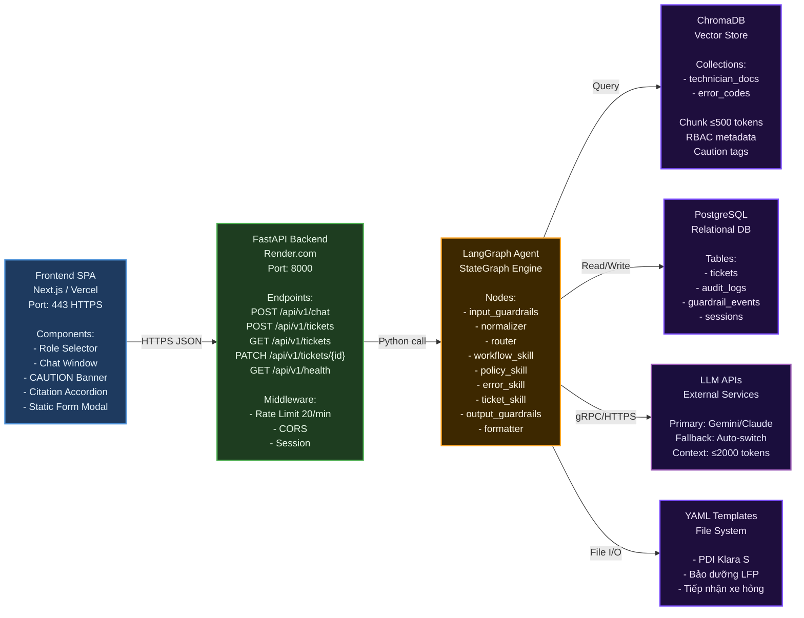
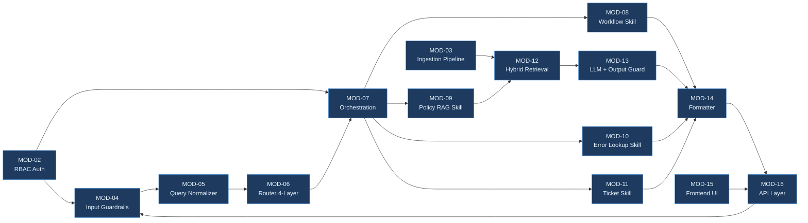
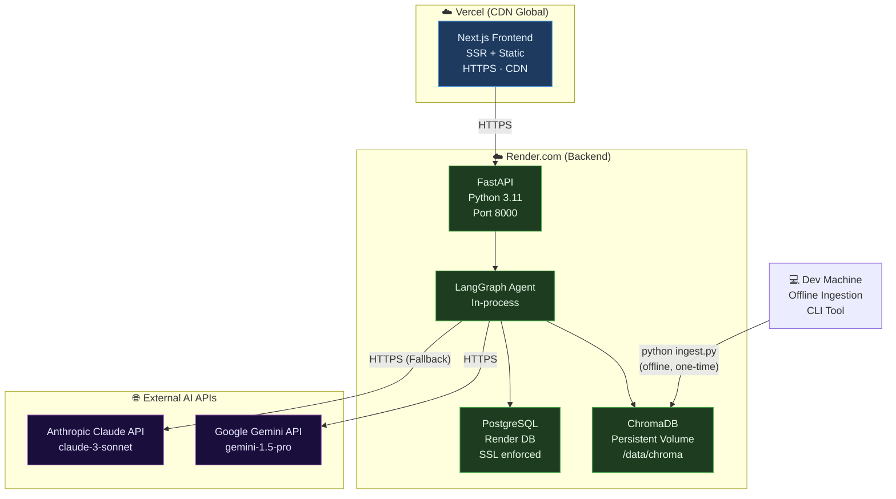
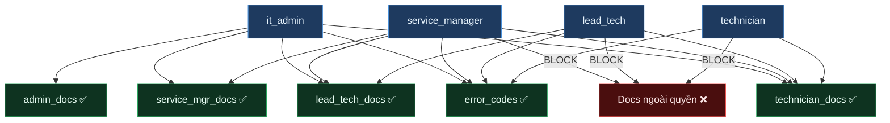

# System Architecture Diagram
## VF-Onboarding Copilot — Toàn cảnh Kiến trúc Hệ thống

| Trường | Nội dung |
| :--- | :--- |
| **Tài liệu** | ARCHITECTURE_DIAGRAM — Gate 2 |
| **Phiên bản** | 1.0.0 |
| **Ngày** | 12/08/2026 |
| **Tham chiếu** | SDD.md v5.0 · MVP_SPEC_P1.md v1.0 |

> **Mục đích:** Sơ đồ kiến trúc tổng thể (System-Level) cho toàn bộ đề tài VF-Onboarding Copilot — thể hiện tất cả các thành phần, tầng hệ thống, luồng dữ liệu, và mối quan hệ giữa các module.

---

## Sơ đồ Kiến trúc Tổng thể (C4 Model — System Context)

```mermaid
flowchart TB
    classDef person fill:#1e3a5f,stroke:#4a90d9,color:#e8f4fd,stroke-width:2px
    classDef client fill:#1e3a5f,stroke:#4a90d9,color:#e8f4fd,stroke-width:2px
    classDef gateway fill:#1e3d20,stroke:#4caf50,color:#e8f8e8,stroke-width:2px
    classDef guard fill:#4a0e0e,stroke:#ef5350,color:#fde8e8,stroke-width:2px
    classDef core fill:#3d2800,stroke:#ffa726,color:#fff9e6,stroke-width:2px
    classDef skill fill:#0e3320,stroke:#26a65b,color:#e8fdf3,stroke-width:2px
    classDef data fill:#1e0e3d,stroke:#7c4dff,color:#f3e8fd,stroke-width:2px
    classDef output fill:#0e2240,stroke:#29b6f6,color:#e8f3fd,stroke-width:2px
    classDef ai fill:#1a0e3d,stroke:#9b59b6,color:#e8e8fd,stroke-width:2px
    classDef ext fill:#1e2535,stroke:#546e7a,color:#cfd8dc,stroke-width:2px,stroke-dasharray:5 5
    classDef success fill:#1b5e20,stroke:#00e676,color:#e8fde8,stroke-width:2px,font-weight:bold
    classDef danger fill:#4a0e0e,stroke:#ff1744,color:#fde8e8,stroke-width:3px,font-weight:bold

    %% ── USERS ──
    KTV["👤 Kỹ Thuật Viên\n(technician)"]:::person
    LT["👤 Tổ Trưởng KT\n(lead_tech)"]:::person
    SM["👤 Quản Lý Xưởng\n(service_manager)"]:::person
    IT["👤 IT Admin\n(it_admin)"]:::person

    %% ── CLIENT LAYER ──
    subgraph L1["🖥️  LAYER 1 — CLIENT  (Vercel)"]
        direction LR
        RS["Role Selector\n4 vai trò"]:::client
        CW["Chat Window\nMarkdown Renderer"]:::client
        CB["CAUTION Banner\n🔴 High Voltage Alert"]:::danger
        CA["Citation Accordion\nXem nguồn tài liệu"]:::client
        SF["Static Form Modal\nAuto-fill context"]:::client
        TC["Ticket Confirmation\nTCK-YYYYMMDD-XXXXXX"]:::client
    end

    %% ── API GATEWAY ──
    subgraph L2["🔀  LAYER 2 — API GATEWAY  (Render.com)"]
        direction LR
        RL["Rate Limiter\n20 req/min"]:::gateway
        MW["CORS & Session\nMiddleware"]:::gateway
        R1["POST /api/v1/chat"]:::gateway
        R2["POST /api/v1/tickets"]:::gateway
        R3["GET /api/v1/tickets"]:::gateway
        R4["PATCH /api/v1/tickets/{id}"]:::gateway
        R5["GET /api/v1/health"]:::gateway
    end

    %% ── INPUT GUARDRAILS ──
    subgraph L3A["🛡️  LAYER 3A — INPUT GUARDRAILS  (10 Checkers · <80ms)"]
        direction LR
        IG["GRD-01 Length · GRD-02 Encoding · GRD-03 Toxic\nGRD-04 Prompt Injection · GRD-05 Jailbreak\nGRD-06 Domain · GRD-07 PII Masker\nGRD-08 SQL/XSS · GRD-09 Spam\nGRD-10 Prompt Firewall (Semantic <50ms)"]:::guard
    end

    %% ── CORE RUNTIME ──
    subgraph L3B["⚙️  LAYER 3B — CORE RUNTIME"]
        direction TB
        QN["🔤 Query Normalizer\nEV Dictionary + Role Context\n<5ms · No LLM"]:::core
        subgraph RTR["🧭 Lightweight Router (4-Layer)"]
            direction LR
            L1C["L1 Cache\n<1ms ~10%"]:::core
            L2T["L2 Trie\n<10ms ~75%"]:::core
            L3E["L3 Embedding\n<80ms ~12%"]:::core
            L4L["L4 LLM\n<500ms ≤3%"]:::core
            L1C --> L2T --> L3E --> L4L
        end
        OE["🎛️ LangGraph Orchestration\nStateGraph Controller\nAgentState Management"]:::core
        QN --> RTR --> OE
    end

    %% ── SKILL MODULES ──
    subgraph L4["🔧  LAYER 4 — SKILL MODULES"]
        direction LR
        WF["📋 Workflow Guidance\nYAML Template Load\nNo LLM · <50ms"]:::skill
        PC["🤖 Policy Copilot\nRAG Engine + Citations\nLLM · <1.5s"]:::skill
        EL["🔍 Error Code Lookup\nRegex + Semantic\nNo LLM · <200ms"]:::skill
        TK["🎫 Ticket Skill\nCreate TCK-YYYYMMDD-XXXXXX\nPriority: urgent/high/normal"]:::skill
    end

    %% ── DATA & RETRIEVAL ──
    subgraph L5["🗄️  LAYER 5 — DATA & RETRIEVAL"]
        direction LR
        subgraph KB["ChromaDB — Knowledge Base"]
            TD["technician_docs\nPDF · DOCX · XLSX\nChunk ≤500 tokens"]:::data
            EC["error_codes\n30 P-codes · 10 BMS\n10 E-codes"]:::data
        end
        subgraph HYB["Hybrid Retrieval Engine"]
            BM["BM25 Lexical\nSearch"]:::data
            VS["Vector Semantic\nSearch"]:::data
            RF["RRF Fusion\n+ Reranker"]:::data
            BM --> RF
            VS --> RF
        end
        IP["Offline Ingestion Pipeline\nCLI · Chunker · RBAC Tagger\nCaution Tagger · Embedding"]:::data
        DB["Ticket & Audit DB\nPostgreSQL\nLogs · Security Events"]:::data
    end

    %% ── OUTPUT DEFENSE ──
    subgraph L6["✅  LAYER 6 — OUTPUT DEFENSE & FORMATTER"]
        direction LR
        OG["OUT-01 Citation · OUT-02 Hallucination\nOUT-03 RBAC Leak · OUT-04 Safety\nOUT-05 Language · OUT-06 Length\nOUT-07 PII Output"]:::output
        FMT["Response Formatter\nMarkdown Checklist\nError Table · Caution Banner\nCitation Accordion"]:::output
        OG --> FMT
    end

    %% ── EXTERNAL AI ──
    subgraph L7["🤖  LAYER 7 — EXTERNAL AI SERVICES"]
        direction LR
        PM["Primary LLM\nGemini / Claude API\nContext ≤2000 tokens"]:::ai
        FB["Fallback LLM\nAuto-switch on failure\nTransparent to user"]:::ai
        PM -.->|"FAIL/TIMEOUT"| FB
    end

    %% ── CONNECTIONS ──
    KTV --> RS
    LT  --> RS
    SM  --> RS
    IT  --> RS
    RS --> CW
    CW -->|"HTTP POST"| RL
    RL --> MW --> R1
    R1 --> IG
    IG -->|"PASS <80ms"| QN
    IG -->|"FAIL HTTP 400/429"| DB

    OE -->|"WORKFLOW"| WF
    OE -->|"RAG_POLICY"| PC
    OE -->|"ERROR_LOOKUP"| EL
    OE -->|"STATIC_FORM"| TK

    WF <-->|"YAML Load"| KB
    EL <-->|"Regex + Query"| EC
    PC --> HYB
    HYB <--> TD
    HYB <--> EC

    PC -->|"conf ≥0.70"| PM
    PC -->|"conf ≥0.70"| FB

    WF --> OG
    EL --> OG
    PC --> OG
    TK --> DB

    FMT -->|"HTTP 200"| CW
    CW --> CB
    CW --> CA
    CW --> SF
    SF -->|"POST /api/v1/tickets"| R2
    R2 --> TK
    R3 --> DB
    R4 --> DB
    IT -->|"Manage tickets"| R3

    IP -->|"Offline ingest"| TD
    IP -->|"Offline ingest"| EC
```

---

## C4 Model — Container Diagram (Chi tiết hơn)

---

## Module Dependency Map

---

## Deployment Architecture

---

## Security & RBAC Model

---

## Tech Stack Summary

| Layer | Technology | Vai trò |
|:---|:---|:---|
| Frontend | Next.js · Vercel | Chat UI · Role Selector · CAUTION Banner |
| API Gateway | FastAPI · Python 3.11 · Render.com | REST endpoints · Rate limiting · CORS |
| Orchestration | LangGraph (StateGraph) | Agent workflow · State management |
| Input Safety | Custom Guardrails (10 checkers) | Input validation · Security |
| Router | Trie + Sentence Transformers + LLM | Intent classification 4-layer |
| Retrieval | ChromaDB · BM25 · Cross-Encoder | Hybrid search · Reranking |
| LLM | Gemini / Claude (Primary + Fallback) | Answer generation |
| Output Safety | Custom Guardrails (7 checkers) | Hallucination · RBAC · PII |
| Database | PostgreSQL (Render) | Tickets · Audit logs |
| Storage | YAML files · ChromaDB volume | Templates · Vector store |
| CI/CD | GitHub Actions · Docker | Build · Test · Deploy |
| Monitoring | OpenTelemetry · Structured logs | Observability · trace_id |

---

## KPI & Performance Targets

| Metric | Target | Measured at |
|:---|:---:|:---|
| Workflow YAML latency | `<50ms` | P95 end-to-end |
| Error Lookup latency | `<200ms` | P95 end-to-end |
| RAG Policy latency | `<1.5s` | P95 end-to-end |
| Router accuracy | `≥90%` | 30 golden queries |
| RAG citations | `100%` | All policy responses |
| Input Guardrails | `<80ms` | Total 10 checkers |
| RBAC leak rate | `0%` | All roles tested |
| Hallucination rate | `≤1%` | Eval dataset |
| LLM fallback | Auto `<2s` | On primary failure |
| Ticket SLA (urgent) | `<1h` | From submission |
