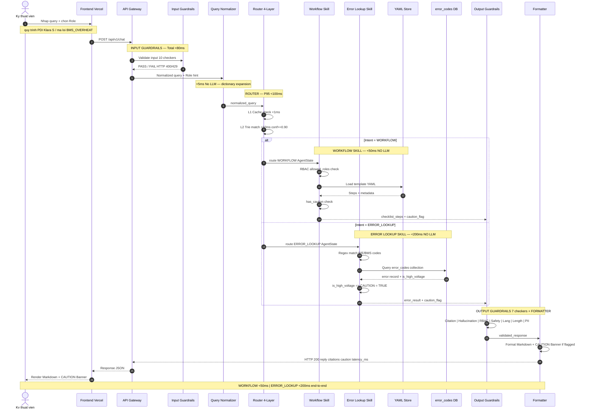

# LUỒNG 1: Happy Path — Tra cứu Quy trình & Mã Lỗi
## VF-Onboarding Copilot — Flow Diagram (WORKFLOW / ERROR_LOOKUP)

> **Phạm vi:** Luồng xử lý tốc độ cao cho câu hỏi về quy trình PDI/bảo dưỡng hoặc tra cứu mã lỗi DTC.
> **Latency Target:** `<50ms` (WORKFLOW - YAML load) | `<200ms` (ERROR_LOOKUP - exact match)
> **Không gọi LLM** trong luồng này (trừ L4 Router fallback <3% traffic).

---

## System Architecture — Layer Overview

```mermaid
flowchart TD
    classDef clientStyle fill:#1e3a5f,stroke:#4a90d9,color:#e8f4fd,stroke-width:2px
    classDef gatewayStyle fill:#2d4a1e,stroke:#5cb85c,color:#e8f8e8,stroke-width:2px
    classDef guardrailStyle fill:#5c1a1a,stroke:#d9534f,color:#fde8e8,stroke-width:2px
    classDef coreStyle fill:#4a3000,stroke:#f0a500,color:#fff9e6,stroke-width:2px
    classDef skillStyle fill:#1a3d2e,stroke:#27ae60,color:#e8fdf3,stroke-width:2px
    classDef dataStyle fill:#2e1a4a,stroke:#8e44ad,color:#f3e8fd,stroke-width:2px
    classDef outputStyle fill:#1a2e4a,stroke:#2980b9,color:#e8f3fd,stroke-width:2px
    classDef decisionStyle fill:#3d2d00,stroke:#e67e22,color:#fff3e0,stroke-width:2px
    classDef successStyle fill:#1a3d1a,stroke:#2ecc71,color:#e8fde8,stroke-width:2px,font-weight:bold
    classDef dangerStyle fill:#5c1a1a,stroke:#e74c3c,color:#fde8e8,stroke-width:3px,font-weight:bold
    classDef timeStyle fill:#0d2233,stroke:#3498db,color:#aed6f1,stroke-width:1px,font-style:italic

    subgraph CLIENT["CLIENT LAYER — Vercel / Mobile Web"]
        direction TB
        U1["👤 Kỹ thuật viên\nRole: technician / lead_tech\nservice_manager / it_admin"]:::clientStyle
        RS["Role Selector\nXác thực 4 vai trò"]:::clientStyle
        CW["Chat Window\n& Markdown Renderer"]:::clientStyle
        U1 --> RS --> CW
    end

    subgraph GATEWAY["API GATEWAY — Render.com / FastAPI"]
        direction TB
        RL["Rate Limiter\n20 req/min/session\nHTTP 429 khi vượt"]:::gatewayStyle
        CORS["CORS & Session\nMiddleware"]:::gatewayStyle
        EP["POST /api/v1/chat\n{ query, user_role, session_id }"]:::gatewayStyle
        RL --> CORS --> EP
    end

    subgraph GUARDRAILS_IN["INPUT GUARDRAILS ENGINE — Tuyến phòng thủ 1"]
        direction LR
        G01["GRD-01\nLength\n2-500 chars"]:::guardrailStyle
        G02["GRD-02\nEncoding\n<30% non-print"]:::guardrailStyle
        G03["GRD-03\nToxic Content"]:::guardrailStyle
        G04["GRD-04\nPrompt Injection"]:::guardrailStyle
        G05["GRD-05\nJailbreak\nDetector"]:::guardrailStyle
        G06["GRD-06\nDomain Policy"]:::guardrailStyle
        G07["GRD-07\nPII Masker\nKHONG reject"]:::guardrailStyle
        G08["GRD-08\nSQL/XSS\nInjection"]:::guardrailStyle
        G09["GRD-09\nSpam Detector\n>20 req/min"]:::guardrailStyle
        G10["GRD-10\nPrompt Firewall\n<50ms Semantic"]:::guardrailStyle
        G01 --> G02 --> G03 --> G04 --> G05 --> G06 --> G07 --> G08 --> G09 --> G10
    end

    GRD_DECISION{"Guardrail\nResult?"}:::decisionStyle
    GRD_FAIL["BLOCK\nHTTP 400/429\n+Log Security Event\n+guardrail_events DB"]:::dangerStyle

    subgraph CORE["CORE RUNTIME & ORCHESTRATION ENGINE"]
        direction TB
        QN["Query Normalizer\nBMS=Battery Mgmt System\nPDI=Pre-Delivery Inspection\nLFP=Lithium Iron Phosphate\n+Role Context Hint | <5ms No LLM"]:::coreStyle

        subgraph ROUTER["Lightweight Router — 4 Layer"]
            direction TB
            L1["L1 Cache\n<1ms - ~10% traffic\nExact match cache"]:::coreStyle
            L2["L2 Trie\n<10ms - ~75% traffic\nKeyword match\nconf>=0.90 route ngay"]:::coreStyle
            L3["L3 Embedding\n<80ms - ~12% traffic\nSemantic classification\nCosine similarity"]:::coreStyle
            L4["L4 LLM\n<500ms - <=3% traffic\nEdge cases only\nTimeout => STATIC_FORM"]:::coreStyle
            L1 -->|"Cache MISS"| L2 -->|"conf <0.90"| L3 -->|"Ambiguous"| L4
        end

        ORCH["Orchestration Engine\nLangGraph StateGraph Controller\nAgentState: raw_query, user_role,\nintent, confidence, need_escalation,\nneed_caution_alert, citations"]:::coreStyle

        QN --> ROUTER --> ORCH
    end

    subgraph SKILLS["SKILL MODULES LAYER"]
        direction LR

        subgraph WF_SKILL["Workflow Guidance Skill"]
            direction TB
            WF_YAML["Load Template YAML\nTinh, khong goi LLM\n<50ms"]:::skillStyle
            WF_RBAC["RBAC Check\nallowed_roles filter"]:::skillStyle
            WF_CAUTION{"has_caution\n= true?"}:::decisionStyle
            WF_CB["CAUTION Banner\nHigh Voltage WARNING"]:::dangerStyle
            WF_OUT["Checklist Steps\nMarkdown format"]:::skillStyle
            WF_YAML --> WF_RBAC --> WF_CAUTION
            WF_CAUTION -->|"YES"| WF_CB --> WF_OUT
            WF_CAUTION -->|"NO"| WF_OUT
        end

        subgraph ERR_SKILL["Error Code Lookup Skill"]
            direction TB
            ERR_REGEX["Regex Exact Match\nP\\d+ | E\\d+ | BMS_\\w+\nU\\d+ | B\\d+\n<200ms"]:::skillStyle
            ERR_DEC{"Exact\nMatch?"}:::decisionStyle
            ERR_KB["Query error_codes\nKnowledge Base"]:::skillStyle
            ERR_SEM["Semantic Fallback\nSuggest 3-5 codes\nSymptom search"]:::skillStyle
            ERR_HV{"is_high_voltage\n= true?"}:::decisionStyle
            ERR_CAUT["CAUTION Banner\nMANDATORY\nFirst element in response"]:::dangerStyle
            ERR_RESULT["Result Table 6 fields:\nMo ta | Nguyen nhan\nBuoc xu ly | Thoi gian\nLinh kien | Nguon"]:::skillStyle
            ERR_REGEX --> ERR_DEC
            ERR_DEC -->|"FOUND"| ERR_KB --> ERR_HV
            ERR_DEC -->|"NOT FOUND"| ERR_SEM --> ERR_HV
            ERR_HV -->|"YES"| ERR_CAUT --> ERR_RESULT
            ERR_HV -->|"NO"| ERR_RESULT
        end
    end

    subgraph DATA["DATA LAYER — ChromaDB"]
        direction LR
        YAML_STORE["YAML Template Store\n3 Workflows:\nPDI Klara S ~10 steps\nBao duong pin LFP ~7 steps\nTiep nhan xe hong ~5 steps"]:::dataStyle
        ERR_DB["error_codes Collection\nChromaDB\n30 P-codes\n10 BMS codes\n10 E-codes\nMetadata: is_high_voltage"]:::dataStyle
    end

    subgraph OUTPUT["OUTPUT DEFENSE & FORMATTER"]
        direction TB

        subgraph OUT_GRD["Output Guardrails — 7 Checkers"]
            direction LR
            O01["OUT-01\nCitation\nCheck"]:::outputStyle
            O02["OUT-02\nHallucination\nDetector"]:::outputStyle
            O03["OUT-03\nRBAC Leak\nChecker"]:::outputStyle
            O04["OUT-04\nSafety\nValidator"]:::outputStyle
            O05["OUT-05\nLanguage VI\nChecker"]:::outputStyle
            O06["OUT-06\nLength\n<=1500 words"]:::outputStyle
            O07["OUT-07\nPII Output\nMasker"]:::outputStyle
            O01 --> O02 --> O03 --> O04 --> O05 --> O06 --> O07
        end

        FMT["Response Formatter\nWORKFLOW: Checklist Markdown\nERROR_LOOKUP: Markdown Table\n+CAUTION Banner do dau tien"]:::outputStyle
    end

    FINAL["Response to Client\nreply, citations, caution_alert\nlatency_ms, confidence\nWORKFLOW: <50ms\nERROR_LOOKUP: <200ms"]:::successStyle

    AUDIT["Audit & Log DB\nTicket & Security Events"]:::dataStyle

    CW -->|"POST /api/v1/chat"| RL
    EP --> GUARDRAILS_IN
    GUARDRAILS_IN --> GRD_DECISION
    GRD_DECISION -->|"Total <80ms PASS"| QN
    GRD_DECISION -->|"FAIL"| GRD_FAIL
    GRD_FAIL --> AUDIT

    ORCH -->|"Intent: WORKFLOW"| WF_SKILL
    ORCH -->|"Intent: ERROR_LOOKUP"| ERR_SKILL

    WF_YAML <-->|"YAML Load"| YAML_STORE
    ERR_KB <-->|"Regex + Query"| ERR_DB

    WF_OUT --> OUT_GRD
    ERR_RESULT --> OUT_GRD
    OUT_GRD --> FMT --> FINAL
    FINAL -->|"HTTP 200"| CW
```

---

## Sequence Diagram — Luồng Thời Gian

---

## Latency Budget Breakdown

| Bước | Component | Budget | Ghi chú |
|:---|:---|:---:|:---|
| ① Input Guardrails GRD-01 to 09 | Guardrails Engine | `<30ms` | Sequential, short-circuit on FAIL |
| ② Input Guardrails GRD-10 | Prompt Firewall Semantic | `<50ms` | Only if GRD-01~09 PASS |
| ③ Query Normalizer | EV Dictionary + Role Hint | `<5ms` | Pure in-memory, no I/O |
| ④ Router L1 Cache | Redis-like cache | `<1ms` | ~10% traffic |
| ④ Router L2 Trie | Keyword matching | `<10ms` | ~75% traffic, conf>=0.90 |
| ⑤A Workflow Skill | YAML load + RBAC check | `<10ms` | In-memory YAML |
| ⑤B Error Lookup | Regex match + KB query | `<150ms` | ChromaDB exact lookup |
| ⑥ Output Guardrails | 7 checkers | `<20ms` | Sequential pipeline |
| ⑦ Formatter | Markdown rendering | `<5ms` | Template-based |
| **TOTAL WORKFLOW** | | **`<50ms`** | Target met |
| **TOTAL ERROR_LOOKUP** | | **`<200ms`** | Target met |

---

## Decision Node Legend

| Ký hiệu | Ý nghĩa |
|:---:|:---|
| CAUTION Banner | Mandatory cho High Voltage content — luôn ở đầu response |
| conf>=0.90 | Router confidence threshold cho Trie routing |
| is_high_voltage=true | Auto-triggers CAUTION banner |
| RBAC filter | Enforced tại mọi điểm truy cập dữ liệu |
| Short-circuit | Guardrails dừng ngay khi gặp FAIL đầu tiên |
| No LLM | Workflow & Error Lookup Skill KHÔNG gọi LLM |
