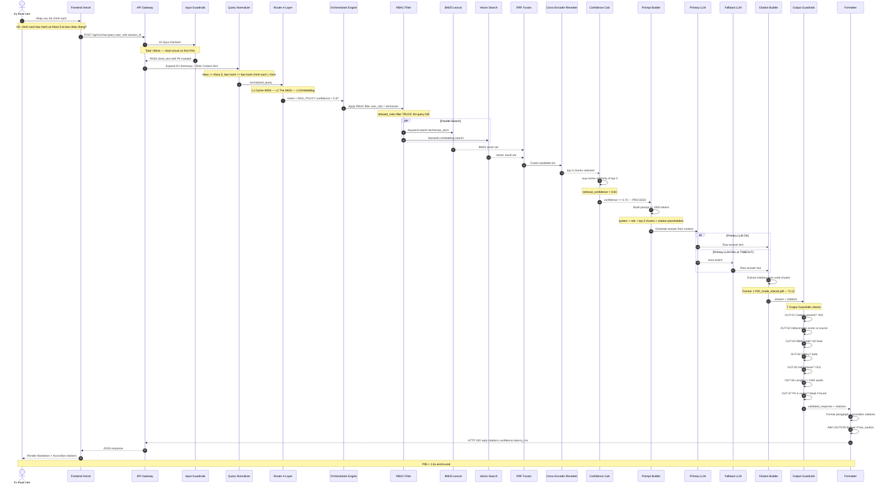
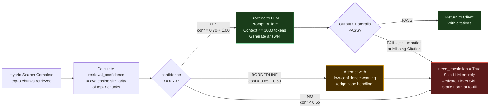
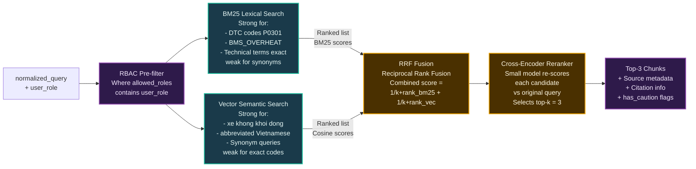

# LUỒNG 2: Tra cứu Chính sách bằng AI — RAG Policy
## VF-Onboarding Copilot — Flow Diagram (RAG_POLICY)

> **Phạm vi:** Luồng AI-powered tra cứu chính sách, quy định, tài liệu nghiệp vụ từ Knowledge Base với trích dẫn nguồn.
> **Latency Target:** `<1.5s` end-to-end (P95)
> **Confidence Threshold:** `0.70` — dưới ngưỡng tự động escalate, không cố trả lời.

---

## System Architecture — RAG Policy Flow

```mermaid
flowchart TD
    classDef clientStyle fill:#1e3a5f,stroke:#4a90d9,color:#e8f4fd,stroke-width:2px
    classDef gatewayStyle fill:#2d4a1e,stroke:#5cb85c,color:#e8f8e8,stroke-width:2px
    classDef guardrailStyle fill:#5c1a1a,stroke:#d9534f,color:#fde8e8,stroke-width:2px
    classDef coreStyle fill:#4a3000,stroke:#f0a500,color:#fff9e6,stroke-width:2px
    classDef skillStyle fill:#1a3d2e,stroke:#27ae60,color:#e8fdf3,stroke-width:2px
    classDef dataStyle fill:#2e1a4a,stroke:#8e44ad,color:#f3e8fd,stroke-width:2px
    classDef outputStyle fill:#1a2e4a,stroke:#2980b9,color:#e8f3fd,stroke-width:2px
    classDef decisionStyle fill:#3d2d00,stroke:#e67e22,color:#fff3e0,stroke-width:2px
    classDef successStyle fill:#1a3d1a,stroke:#2ecc71,color:#e8fde8,stroke-width:2px,font-weight:bold
    classDef dangerStyle fill:#5c1a1a,stroke:#e74c3c,color:#fde8e8,stroke-width:3px,font-weight:bold
    classDef aiStyle fill:#1a1a4a,stroke:#9b59b6,color:#e8e8fd,stroke-width:2px
    classDef retrievalStyle fill:#1a3a4a,stroke:#1abc9c,color:#e8f8f5,stroke-width:2px

    subgraph CLIENT["CLIENT LAYER — Vercel / Mobile Web"]
        U1["👤 Ky thuat vien\nRole: technician / lead_tech\nservice_manager / it_admin"]:::clientStyle
        RS["Role Selector\nXac thuc 4 vai tro"]:::clientStyle
        CW["Chat Window\n& Markdown Renderer\n+ Citation Accordion"]:::clientStyle
        U1 --> RS --> CW
    end

    subgraph GATEWAY["API GATEWAY — Render.com"]
        RL["Rate Limiter\n20 req/min/session"]:::gatewayStyle
        CORS["CORS & Session\nMiddleware"]:::gatewayStyle
        EP["POST /api/v1/chat\nquery user_role session_id"]:::gatewayStyle
        RL --> CORS --> EP
    end

    subgraph GUARDRAILS_IN["INPUT GUARDRAILS — 10 Checkers Total <80ms"]
        direction LR
        GRD["GRD-01 Length\nGRD-02 Encoding\nGRD-03 Toxic\nGRD-04 Prompt Injection\nGRD-05 Jailbreak\nGRD-06 Domain\nGRD-07 PII Masker\nGRD-08 SQL/XSS\nGRD-09 Spam\nGRD-10 Firewall Semantic"]:::guardrailStyle
    end

    GRD_DEC{"Guardrail\nResult?"}:::decisionStyle
    GRD_FAIL["BLOCK\nHTTP 400/429\nLog Security Event"]:::dangerStyle

    subgraph CORE["CORE RUNTIME — Normalizer + Router + Orchestration"]
        QN["Query Normalizer\nEV Dictionary expansion\n+Role Context Hint | <5ms"]:::coreStyle

        subgraph ROUTER["Lightweight Router — 4 Layer"]
            L1["L1 Cache <1ms"]:::coreStyle
            L2["L2 Trie <10ms\nconf>=0.90"]:::coreStyle
            L3["L3 Embedding <80ms\nSemantic similarity"]:::coreStyle
            L4["L4 LLM <=3% edge cases"]:::coreStyle
            L1 -->|"MISS"| L2 -->|"conf<0.90"| L3 -->|"Ambiguous"| L4
        end

        RTR_DEC{"Intent\nClassified"}:::decisionStyle
        ORCH["Orchestration Engine\nLangGraph StateGraph\nAgentState Management"]:::coreStyle

        QN --> ROUTER --> RTR_DEC
        RTR_DEC -->|"RAG_POLICY"| ORCH
    end

    subgraph POLICY_SKILL["POLICY COPILOT SKILL — RAG Engine"]
        direction TB

        subgraph RETRIEVAL["HYBRID RETRIEVAL ENGINE"]
            direction LR
            RBAC_FILTER["RBAC Filter\nat DB Level\nallowed_roles metadata\nApply TRUOC khi search"]:::dataStyle
            BM25["BM25 Lexical Search\nKeyword exact match\nThuat ngu ky thuat"]:::retrievalStyle
            VEC["Vector Search\nSemantic embedding\nCosine similarity"]:::retrievalStyle
            RRF["RRF Fusion\nReciprocal Rank Fusion\nKet hop 2 ket qua"]:::retrievalStyle
            RERANK["Cross-Encoder Reranker\nChon top-k chunks\nk=3 final selection"]:::retrievalStyle

            RBAC_FILTER --> BM25
            RBAC_FILTER --> VEC
            BM25 --> RRF
            VEC --> RRF
            RRF --> RERANK
        end

        CONF_CALC["Confidence Calculator\nretrieval_confidence\n= avg cosine similarity\nof top-3 chunks"]:::coreStyle

        CONF_CHECK{"confidence\n>= 0.70?"}:::decisionStyle

        PROMPT_BUILD["Prompt Builder\nSystem prompt + Role\n+Retrieved context\n<=2000 tokens total\n+Citation injection"]:::coreStyle

        ESCALATE_FLAG["Set AgentState:\nneed_escalation = True\nNo LLM call made\nRedirect to Ticket Skill"]:::dangerStyle

        RERANK --> CONF_CALC --> CONF_CHECK
        CONF_CHECK -->|"YES >= 0.70"| PROMPT_BUILD
        CONF_CHECK -->|"NO < 0.70"| ESCALATE_FLAG
    end

    subgraph LLM_LAYER["EXTERNAL AI SERVICES"]
        direction LR
        PRIMARY["Primary LLM\nGemini / Claude API\nContext <= 2000 tokens\nInstr: ban sat context\nkhong suy doan ngoai TL"]:::aiStyle
        FALLBACK["Fallback LLM\nDu phong tu dong\nAuto-switch on\nPrimary fail/timeout"]:::aiStyle
        PRIMARY -.->|"FAIL / TIMEOUT"| FALLBACK
    end

    subgraph CITATION_BUILD["CITATION BUILDER"]
        CITE["Extract Citations\ntu chunks da dung\nFormat: STT TenFile — Trang X\nE.g: 1 PDI_Guide_KlaraS.pdf — Tr.12"]:::outputStyle
    end

    subgraph OUTPUT_GUARD["OUTPUT GUARDRAILS — 7 Checkers"]
        direction TB
        OUT_FLOW["OUT-01 Citation Requirement\nThieu citation => huy + escalate\n\nOUT-02 Hallucination Detector\nSimilarity vs source < nguong => escalate\n\nOUT-03 RBAC Leak Checker\nChua thong tin ngoai quyen => huy + escalate\n\nOUT-04 Safety Validator\nHuong dan nguy hiem => CAUTION / huy\n\nOUT-05 Language Checker\nKhong phai tieng Viet => regenerate\n\nOUT-06 Length Checker\n>1500 tu => truncate + tom tat\n\nOUT-07 PII Output Masker\nMask PII truoc khi gui user"]:::outputStyle

        OUT_DEC{"All Guards\nPASS?"}:::decisionStyle
        OUT_FAIL["Escalate\nneed_escalation = True\nGo to Ticket Skill"]:::dangerStyle
    end

    subgraph FORMATTER["RESPONSE FORMATTER"]
        FMT["Format RAG_POLICY Response:\n- Doan van trich gon tieng Viet\n- [1] Nguon trich dan\n- [2] Nguon trich dan\n- Accordion collapsible citations\n- CAUTION Banner neu has_caution"]:::outputStyle
    end

    FINAL["Response to Client\nreply: Markdown paragraph\ncitations: STT File Page\ncaution_alert: bool\nconfidence: float\nlatency_ms: number\nP95 < 1.5s"]:::successStyle

    subgraph KB_LAYER["KNOWLEDGE BASE — ChromaDB"]
        direction LR
        TECH_DOCS["technician_docs Collection\nPDI guides DOCX/PDF\nBao duong quy trinh\nRBac: technician lead_tech\nservice_manager\nChunk <= 500 tokens\nOverlap: 50 tokens"]:::dataStyle
        ERR_DOCS["error_codes Collection\nDTC P/E/BMS/U/B codes\nMetadata: is_high_voltage\nhas_caution vehicle_model"]:::dataStyle
    end

    AUDIT_DB["Audit & Ticket DB\nLogs + Security Events\nQuery history + Citations used"]:::dataStyle

    CW -->|"POST /api/v1/chat"| RL
    EP --> GUARDRAILS_IN
    GUARDRAILS_IN --> GRD_DEC
    GRD_DEC -->|"PASS <80ms"| QN
    GRD_DEC -->|"FAIL"| GRD_FAIL
    GRD_FAIL --> AUDIT_DB

    RBAC_FILTER <-->|"Filter by allowed_roles\nMetadata query"| TECH_DOCS
    RBAC_FILTER <-->|"Filter by allowed_roles"| ERR_DOCS

    ORCH --> RETRIEVAL
    PROMPT_BUILD --> PRIMARY
    PROMPT_BUILD --> FALLBACK
    PRIMARY --> CITE
    FALLBACK --> CITE
    CITE --> OUT_FLOW
    OUT_FLOW --> OUT_DEC
    OUT_DEC -->|"PASS"| FMT
    OUT_DEC -->|"FAIL"| OUT_FAIL
    FMT --> FINAL
    FINAL -->|"HTTP 200"| CW
    OUT_FAIL --> AUDIT_DB
    ESCALATE_FLAG --> AUDIT_DB
```

---

## Sequence Diagram — RAG Policy Flow Chi Tiết

---

## Confidence Decision Tree

---

## RBAC Data Access Matrix

| User Role | technician_docs | error_codes | service_manager_docs | it_admin_docs |
|:---|:---:|:---:|:---:|:---:|
| `technician` | ✅ | ✅ | ❌ | ❌ |
| `lead_tech` | ✅ | ✅ | ❌ | ❌ |
| `service_manager` | ✅ | ✅ | ✅ | ❌ |
| `it_admin` | ✅ | ✅ | ✅ | ✅ |

> **Rule:** RBAC filter được áp dụng tại tầng DB query — TRƯỚC khi BM25 và Vector Search. Không bao giờ filter sau retrieval.

---

## Latency Budget — RAG Policy Flow

| Bước | Component | Budget | Ghi chú |
|:---|:---|:---:|:---|
| ① Input Guardrails | 10 checkers | `<80ms` | GRD-10 chiếm phần lớn |
| ② Query Normalizer | EV dictionary | `<5ms` | In-memory, no I/O |
| ③ Router L3 Embedding | Semantic classification | `<80ms` | Most RAG_POLICY queries |
| ④ RBAC Filter | Metadata filter | `<5ms` | In-memory filter |
| ④ BM25 + Vector Search | Parallel hybrid search | `<200ms` | ChromaDB local |
| ⑤ RRF Fusion | Score combination | `<10ms` | CPU computation |
| ⑤ Cross-Encoder Rerank | Re-score top candidates | `<100ms` | Small model |
| ⑥ Prompt Builder | Context assembly | `<5ms` | Template fill |
| ⑦ LLM Generation | Primary / Fallback | `<800ms` | Network + inference |
| ⑧ Output Guardrails | 7 checkers | `<50ms` | Hallucination check costs most |
| ⑨ Formatter | Markdown + citations | `<10ms` | Template rendering |
| **TOTAL P95** | | **`<1.5s`** | ✅ Target met |

---

## Hybrid Search Architecture Detail

