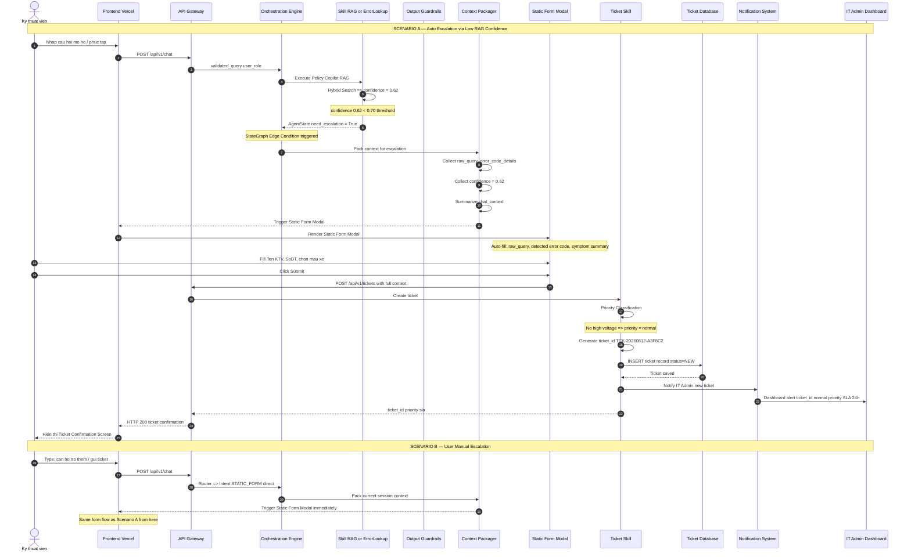
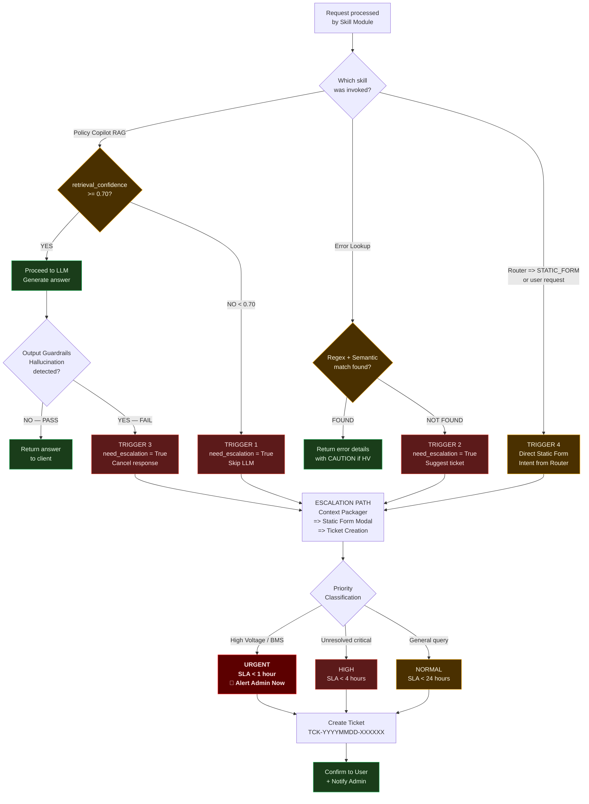
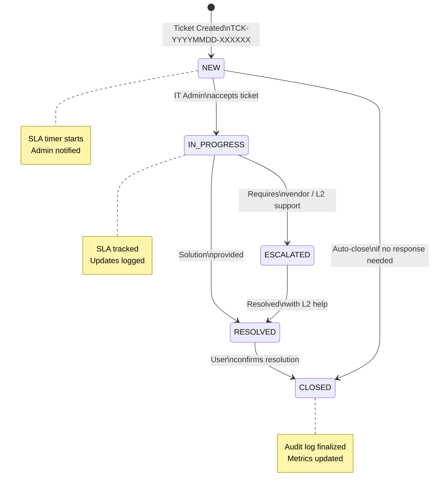

# LUỒNG 3: Chuyển giao Hỗ trợ — Escalation & Static Form
## VF-Onboarding Copilot — Flow Diagram (ESCALATION / STATIC_FORM)

> **Phạm vi:** Cơ chế fail-safe — kích hoạt khi AI không đủ tự tin, mã lỗi không tìm thấy, hoặc người dùng chủ động yêu cầu hỗ trợ.
> **Trigger Conditions:** RAG confidence < 0.70 | Error Not Found | Hallucination detected | User request
> **Latency Target:** Static Form render `<2s` | Ticket submit `<30s`
> **SLA:** urgent `<1h` | high `<4h` | normal `<24h`

---

## System Architecture — Escalation Flow

```mermaid
flowchart TD
    classDef clientStyle fill:#1e3a5f,stroke:#4a90d9,color:#e8f4fd,stroke-width:2px
    classDef gatewayStyle fill:#2d4a1e,stroke:#5cb85c,color:#e8f8e8,stroke-width:2px
    classDef guardrailStyle fill:#5c1a1a,stroke:#d9534f,color:#fde8e8,stroke-width:2px
    classDef coreStyle fill:#4a3000,stroke:#f0a500,color:#fff9e6,stroke-width:2px
    classDef skillStyle fill:#1a3d2e,stroke:#27ae60,color:#e8fdf3,stroke-width:2px
    classDef dataStyle fill:#2e1a4a,stroke:#8e44ad,color:#f3e8fd,stroke-width:2px
    classDef outputStyle fill:#1a2e4a,stroke:#2980b9,color:#e8f3fd,stroke-width:2px
    classDef decisionStyle fill:#3d2d00,stroke:#e67e22,color:#fff3e0,stroke-width:2px
    classDef successStyle fill:#1a3d1a,stroke:#2ecc71,color:#e8fde8,stroke-width:2px,font-weight:bold
    classDef dangerStyle fill:#5c1a1a,stroke:#e74c3c,color:#fde8e8,stroke-width:3px,font-weight:bold
    classDef urgentStyle fill:#5c0000,stroke:#ff0000,color:#ffe8e8,stroke-width:3px,font-weight:bold
    classDef warnStyle fill:#4a3000,stroke:#f0a500,color:#fff9e6,stroke-width:2px
    classDef adminStyle fill:#1a1a4a,stroke:#7f8c8d,color:#d5d8dc,stroke-width:2px

    %% ═══════════════════════════════════════════
    %% TRIGGER SOURCES
    %% ═══════════════════════════════════════════
    subgraph TRIGGERS["ESCALATION TRIGGER SOURCES — 4 Paths"]
        direction LR

        T1["TRIGGER 1 — AUTO\nRAG confidence < 0.70\nPolicy Copilot Skill\n=> need_escalation = True"]:::dangerStyle

        T2["TRIGGER 2 — AUTO\nError Not Found\nError Lookup Skill\nRegex + Semantic both FAIL\n=> need_escalation = True"]:::dangerStyle

        T3["TRIGGER 3 — AUTO\nOutput Guardrail FAIL\nHallucination detected\nOUT-02 score < threshold\n=> need_escalation = True"]:::dangerStyle

        T4["TRIGGER 4 — MANUAL\nUser Request\ncan ho tro / gui ticket\nkhong tim duoc\nROUTER => STATIC_FORM intent"]:::warnStyle
    end

    %% ═══════════════════════════════════════════
    %% STATEGRAPH CONTROLLER
    %% ═══════════════════════════════════════════
    subgraph ORCH_CTRL["ORCHESTRATION ENGINE — StateGraph Controller"]
        direction TB
        STATE["AgentState Update\nneed_escalation = True\ncaution flag inherited\nerror_code_details captured\nraw_query preserved\nchat_context summarized"]:::coreStyle

        EDGE_CHECK{"StateGraph\nEdge Condition:\nneed_escalation\n= True?"}:::decisionStyle

        CONTEXT_PACK["Context Packager\nAuto-collect from AgentState:\n- raw_query (from request)\n- error_code_details (from skill)\n- retrieval_confidence score\n- router_layer_used\n- session_id + trace_id\n- chat_context summary"]:::coreStyle

        STATE --> EDGE_CHECK
        EDGE_CHECK -->|"YES — Route to Ticket Skill"| CONTEXT_PACK
    end

    %% ═══════════════════════════════════════════
    %% TICKET SKILL
    %% ═══════════════════════════════════════════
    subgraph TICKET_SKILL["SUPPORT TICKET SKILL"]
        direction TB

        subgraph FORM_FILL["Static Form Auto-fill Logic"]
            direction LR
            AF1["Auto-fill Fields:\n- Cau hoi goc: raw_query\n- Ma loi: error_code_details\n- Mo ta trieu chung:\n  Summarized context\n- Session context"]:::skillStyle

            MF1["Manual Fields\n(User nhap):\n- Ten ky thuat vien\n- So dien thoai lien he\n- Mau xe chon dropdown\n- Chi tiet them"]:::skillStyle

            AF1 ---|"Merged into"| FORM_DATA
            MF1 ---|"Merged into"| FORM_DATA
            FORM_DATA["Complete Form Data\nvalidated before submit"]:::skillStyle
        end

        subgraph PRIORITY_ENGINE["Priority Classification Engine"]
            direction TB
            PRI_CHECK{"Auto-classify\nPriority"}:::decisionStyle

            PRI_URGENT["URGENT\nSLA < 1 gio\nTrigger: Dien cao ap\nPin LFP he thong BMS\nRui ro an toan cao"]:::urgentStyle

            PRI_HIGH["HIGH\nSLA < 4 gio\nTrigger: Ma loi\nnghiem trong khong\ngiai quyet duoc"]:::dangerStyle

            PRI_NORMAL["NORMAL\nSLA < 24 gio\nTrigger: Cau hoi\nthong thuong khong\ngiai quyet duoc"]:::warnStyle

            PRI_CHECK -->|"High Voltage / BMS"| PRI_URGENT
            PRI_CHECK -->|"Unresolved critical code"| PRI_HIGH
            PRI_CHECK -->|"General unresolved query"| PRI_NORMAL
        end

        TICKET_ID["Ticket ID Generator\nFormat: TCK-YYYYMMDD-XXXXXX\n6 chars hex random\nUnique constraint enforced\nExample: TCK-20260812-A3F8C2"]:::skillStyle

        TICKET_STATUS["Initial Status: NEW\nTransition: NEW => In Progress => Closed"]:::skillStyle

        FORM_DATA --> PRI_CHECK
        PRI_URGENT --> TICKET_ID
        PRI_HIGH --> TICKET_ID
        PRI_NORMAL --> TICKET_ID
        TICKET_ID --> TICKET_STATUS
    end

    %% ═══════════════════════════════════════════
    %% STATIC FORM UI
    %% ═══════════════════════════════════════════
    subgraph FORM_UI["STATIC FORM MODAL — Frontend Component"]
        direction TB
        MODAL["Static Form Modal Popup\nAuto-fill context visible\nUser editable fields highlighted\nSubmit / Cancel buttons"]:::clientStyle

        FORM_PREVIEW["Form Field Preview:\n[Auto] Cau hoi goc: raw_query\n[Auto] Ma loi: BMS_OVERHEAT\n[Auto] Mo ta: summarized chat\n[User] Ten KTV: ___________\n[User] SoDT: ___________\n[Select] Mau xe: [Klara S v]\n[User] Chi tiet them: ___"]:::clientStyle

        SUBMIT_BTN["Submit Button\nPOST /api/v1/tickets\n{ ticket_data, session_id }"]:::clientStyle

        MODAL --> FORM_PREVIEW --> SUBMIT_BTN
    end

    %% ═══════════════════════════════════════════
    %% DATA STORAGE
    %% ═══════════════════════════════════════════
    subgraph DB_LAYER["DATABASE LAYER"]
        direction LR
        TICKET_DB["Ticket Database\nPostgreSQL\nFields:\n- ticket_id UNIQUE\n- created_at timestamp\n- status NEW\n- priority urgent/high/normal\n- user_role\n- raw_query\n- error_code_details\n- symptom_description\n- technician_name\n- phone_contact\n- vehicle_model\n- session_id trace_id\n- sla_deadline"]:::dataStyle

        AUDIT_DB["Audit & Security Log\n- guardrail_events\n- escalation_reason\n- retrieval_confidence\n- router_layer_used\n- llm_response if any\n- timestamp + session"]:::dataStyle
    end

    %% ═══════════════════════════════════════════
    %% NOTIFICATION
    %% ═══════════════════════════════════════════
    subgraph NOTIFY["NOTIFICATION SYSTEM"]
        direction TB
        NOTIFY_ADMIN["IT Admin Notification\nNew ticket alert\nticket_id priority SLA\nVia: Dashboard / Email"]:::adminStyle

        ADMIN_DASH["IT Admin Dashboard\nGET /api/v1/tickets\nFilter by: status priority date\nManage: PATCH /api/v1/tickets/id"]:::adminStyle

        NOTIFY_ADMIN --> ADMIN_DASH
    end

    %% ═══════════════════════════════════════════
    %% CLIENT RESPONSE
    %% ═══════════════════════════════════════════
    subgraph CLIENT_RES["CLIENT RESPONSE — Ticket Confirmation"]
        CONFIRM["Ticket Confirmation Screen\nXin chao [Ten KTV]\nYeu cau cua ban da duoc ghi nhan.\nMa ticket: TCK-20260812-A3F8C2\nDo uu tien: URGENT / HIGH / NORMAL\nSLA: Chung toi se phan hoi trong X gio.\nTeam ky thuat se lien he qua SoDT."]:::successStyle
    end

    %% ═══════════════════════════════════════════
    %% CONNECTIONS
    %% ═══════════════════════════════════════════
    T1 --> STATE
    T2 --> STATE
    T3 --> STATE
    T4 --> STATE

    CONTEXT_PACK --> FORM_UI

    FORM_UI --> TICKET_SKILL

    TICKET_STATUS -->|"POST /api/v1/tickets"| TICKET_DB
    TICKET_DB --> NOTIFY_ADMIN
    TICKET_DB --> AUDIT_DB

    TICKET_STATUS --> CONFIRM
    CONFIRM -->|"HTTP 200\n{ ticket_id, priority, sla }"| FORM_UI
```

---

## Sequence Diagram — Escalation Flow Chi Tiết

---

## Trigger Decision Tree

---

## Static Form Field Specification

| Field | Source | Editable | Required | Notes |
|:---|:---|:---:|:---:|:---|
| Câu hỏi gốc | `AgentState.raw_query` | ❌ Auto | ✅ | Displayed read-only |
| Mã lỗi phát hiện | `AgentState.error_code_details` | ❌ Auto | ❌ | Empty if not an error query |
| Mô tả triệu chứng | Summarized `chat_context` | ✅ Editable | ✅ | User can add details |
| Tên kỹ thuật viên | User input | ✅ Manual | ✅ | Free text |
| Số điện thoại | User input | ✅ Manual | ✅ | Validated format |
| Mẫu xe | User dropdown | ✅ Select | ❌ | Klara S / Feliz S / Vento S / Evo200 |

---

## Ticket Priority & SLA Matrix

| Trigger Condition | Priority | SLA | Notify |
|:---|:---:|:---:|:---|
| Liên quan điện cao áp / pin LFP / BMS | 🔴 `urgent` | `< 1 giờ` | Immediate admin alert |
| Mã lỗi nghiêm trọng không giải quyết được | 🟠 `high` | `< 4 giờ` | Dashboard notification |
| Câu hỏi thông thường không giải được | 🟡 `normal` | `< 24 giờ` | Standard queue |

---

## Ticket Status Flow

---

## Latency Budget — Escalation Flow

| Bước | Component | Budget | Ghi chú |
|:---|:---|:---:|:---|
| ① Trigger detection | Skill / Output Guard | `<0ms` | Part of existing flow |
| ② StateGraph edge condition | Orchestration | `<1ms` | In-memory state check |
| ③ Context packaging | Context Packager | `<10ms` | AgentState read |
| ④ Static Form render | Frontend Modal | `<500ms` | Network + render |
| ⑤ User fills form | Human interaction | variable | Not measured |
| ⑥ Ticket submission | POST /api/v1/tickets | `<2s` | DB write + validation |
| ⑦ Priority classification | Priority Engine | `<5ms` | Rule-based logic |
| ⑧ Ticket ID generation | UUID hex | `<1ms` | Cryptographic random |
| ⑨ DB insert | PostgreSQL | `<100ms` | Single row insert |
| ⑩ Admin notification | Notification System | `<1s` | Async dispatch |
| ⑪ Confirmation response | HTTP 200 | `<200ms` | JSON response |
| **TOTAL Form Render** | | **`<2s`** | ✅ Target met |
| **TOTAL Ticket Submit** | | **`<30s`** | ✅ Target met (includes user fill time) |

---

## Integration Notes

> **Fail-safe Guarantee:** The Escalation flow is the ULTIMATE fallback — it should NEVER itself fail. The Static Form is a pure static HTML form with no AI dependency. If the backend is unavailable, the form data is stored locally and retried.

> **RBAC in Escalation:** Even in escalation, the ticket inherits the `user_role` from the session. IT Admin can see all tickets. Service Manager sees their DLPP's tickets only.

> **Audit Trail:** Every escalation event is logged to `guardrail_events` with: `escalation_reason`, `trigger_source`, `retrieval_confidence`, `session_id`, `trace_id`, `timestamp`.
