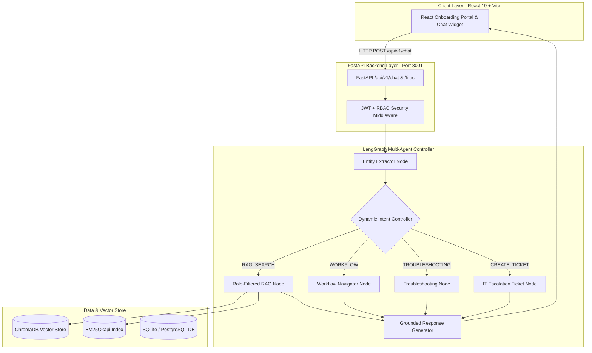

# ⚡ VinFast AI Onboarding & Operations Agent
### Team The Sigmoid — AI20K Build Phase Cohort 3 (P-223)

> **Sản phẩm:** Trợ lý AI Hỗ trợ Onboarding & Vận hành Đại lý Phân phối (ĐLPP) Xe máy Điện VinFast  
> **Kiến trúc:** LangGraph Multi-Agent + Dynamic Controller Router + Hybrid RAG (ChromaDB + BM25 + CrossEncoder Reranker) + FastAPI + React 19 (Vite) 

---

## 📖 Table of Contents

1. [Giới thiệu Dự án (Overview)](#-giới-thiệu-dự-án-overview)
2. [Tính năng Nổi bật (Key Features)](#-tính-năng-nổi-bật-key-features)
3. [Kiến trúc Hệ thống (System Architecture)](#-kiến-trúc-hệ-thống-system-architecture)
4. [Cấu hình Môi trường (Environment Variables)](#-cấu-hình-môi-trường-environment-variables)
5. [Hướng dẫn Cài đặt & Chạy (Setup Instructions)](#-hướng-dẫn-cài-đặt--chạy-setup-instructions)
6. [Bộ Câu Hỏi Mẫu (Sample Queries)](#-bộ-câu-hỏi-mẫu-sample-queries)
7. [Kết quả Đánh giá (Evaluation Benchmark)](#-kết-quả-đánh-giá-evaluation-benchmark)
8. [Cấu trúc Thư mục (Directory Structure)](#-cấu-trúc-thư-mục-directory-structure)

---

## 🎯 Giới thiệu Dự án (Overview)

Nhân sự mới tại các **Đại lý Phân phối (ĐLPP) Xe máy Điện VinFast** (Bán hàng, Kế toán, Kỹ thuật viên) thường gặp khó khăn khi tiếp cận khối lượng tài liệu vận hành đồ sộ (DMS, quy trình Claim, chính sách bảo hành Pin LFP, các quy định phân quyền nhạy cảm).

**VF AI Onboarding Agent** giải quyết bài toán này qua 3 Sub-Tracks tích hợp:
- **Track 1 (Onboarding Portal):** Cổng tự học phân theo vai trò (`owner`, `accountant`, `technician`, `sale`, `manager`) kèm bài trắc nghiệm tình huống & sandbox kiểm tra DMS.
- **Track 2 (AI Chat Assistant):** Trợ lý AI hỏi đáp thông minh dựa trên LangGraph Agent, tự động tra cứu tài liệu, trích dẫn nguồn (slide/mục/timestamp), và chuyển tiếp (escalation) tới IT Support khi thiếu thông tin.
- **Track 3 (Data Ingestion & Security Pipeline):** Đường ống tự động xử lý tài liệu đa định dạng (PDF, DOCX, PPTX, XLSX, MP4 Video Transcription via Faster-Whisper), khử dữ liệu cá nhân PII (Presidio) và phân quyền bảo mật vai trò (RBAC).

---

## ⚡ Tính năng Nổi bật (Key Features)

- **Dynamic Smart Controller Router (<100ms):** Phân loại ý định (Intent) tức thì: `RAG_SEARCH`, `WORKFLOW`, `TROUBLESHOOTING`, `CREATE_TICKET`, `GENERAL_QA`.
- **Hybrid Retrieval & CrossEncoder Reranking:** Kết hợp Vector Search (ChromaDB) + Keyword Search (BM25Okapi) và Rerank (CrossEncoder ms-marco-MiniLM) cho độ chính xác cao.
- **Bảo mật Phân quyền RBAC Tuyệt đối (100% Role Compliance):** Đảm bảo nhân viên Sales không truy cập được tài liệu bảo hành kỹ thuật hoặc chiết khấu tài chính của Kế toán/Manager.
- **Xử lý Đa Phương Tiện (Multi-Modal):** Đọc nội dung bảng biểu trong PDF/Excel và trích xuất chữ từ video đào tạo MP4 (Faster-Whisper).
- **Xem trực tiếp PDF & Video trên UI (Inline Viewer):** Tích hợp Blob Viewer trên React Modal, ngăn trình duyệt tải file PDF tự động về máy.

---

## 🏗 Kiến trúc Hệ thống (System Architecture)



---

## ⚙️ Cấu hình Môi trường (Environment Variables)

Sao chép file `.env.example` thành `.env` và thiết lập các giá trị sau:

```bash
cp .env.example .env
```

| Biến Môi Trường | Mặc Định / Ví Dụ | Mô Tả |
|-----------------|------------------|-------|
| `OPENAI_API_KEY` | `sk-proj-...` | API Key chính dùng cho OpenAI (GPT-4o-mini). |
| `GOOGLE_API_KEY` | `AIzaSy...` | API Key dự phòng tự động (Fallback) cho Gemini (gemini-2.5-flash). |
| `MODEL_NAME` | `gpt-4o-mini` | Model LLM chính. |
| `GEMINI_MODEL_NAME` | `gemini-2.5-flash` | Model LLM dự phòng khi OpenAI gặp sự cố quota. |
| `DATABASE_URL` | `sqlite:///./data/app.db` | Cơ sở dữ liệu SQLAlchemy. Tự động fallback sang SQLite nếu PostgreSQL tắt. |
| `CHROMA_PERSIST_DIR` | `./data/chroma` | Thư mục lưu trữ ChromaDB vector store. |
| `ONBOARDING_MEDIA_DIR` | `data/raw` | Thư mục gốc chứa tài liệu PDF/Video onboarding. |
| `APP_ENV` | `development` | Môi trường ứng dụng (`development` / `production`). |
| `APP_PORT` | `8001` | Cổng chạy FastAPI Backend. |
| `CORS_ORIGINS` | `http://localhost:5173,http://localhost:3000` | Danh sách domain được phép gọi API. |
| `LANGCHAIN_TRACING_V2` | `true` | Bật LangSmith Tracing cho AI Logs (Deliverable #4). |
| `LANGCHAIN_API_KEY` | `lsv2_pt_...` | API Key LangSmith để theo dõi agent trajectory. |
| `LANGCHAIN_PROJECT` | `p-223-vfn-agent` | Tên dự án trên LangSmith dashboard. |

---

## 🚀 Hướng dẫn Cài đặt & Chạy (Setup Instructions)

### Yêu cầu Tiền đề (Prerequisites)
- **Python:** `3.11` hoặc cao hơn.
- **Node.js:** `18.x` hoặc cao hơn (dùng `npm`).
- **Git**

---

### Bước 1: Clone Repository & Tạo Môi trường Python

```bash
# Clone repository
git clone https://github.com/AI20K-Build-Phase-Cohort-3/P-223.git
cd P-223

# Tạo virtual environment
python -m venv .venv

# Kích hoạt venv (Windows PowerShell)
.venv\Scripts\Activate.ps1

# Kích hoạt venv (Linux / macOS)
source .venv/bin/activate

# Cài đặt toàn bộ dependencies Python
pip install -r requirements.txt
```

---

### Bước 2: Khởi tạo Cấu hình & Cơ sở Dữ liệu

```bash
# Tạo file .env từ template
cp .env.example .env

# Chạy script khởi tạo vector store và nạp index BM25
python scripts/run_evaluation.py
```

---

### Bước 3: Chạy Backend (FastAPI Server)

```bash
# Chạy uvicorn server ở cổng 8001
uvicorn src.main:app --port 8001 --reload
```
> 🌐 Backend API Documentation (Swagger UI): [http://localhost:8001/docs](http://localhost:8001/docs)

---

### Bước 4: Chạy Frontend (React 19 + Vite)

Mở một cửa sổ Terminal mới:

```bash
# Di chuyển vào thư mục frontend
cd frontend

# Cài đặt dependencies Node.js
npm install

# Chạy dev server
npm run dev
```
> 🖥 Website Onboarding Portal: [http://localhost:5173](http://localhost:5173)

---

### 🐳 Chạy ứng dụng bằng Docker (Tuỳ chọn)

```bash
# Build và khởi chạy Docker Compose
docker-compose up -d --build
```

---

### 🧪 Chạy Kiểm thử (Tests) & Benchmark Evaluation

```bash
# Chạy Unit & Integration Tests tự động với PyTest
pytest tests/ -v

# Chạy Benchmark RAG Retrieval & Role Compliance Evaluation
python scripts/run_evaluation.py
```

---

## 💡 Bộ Câu Hỏi Mẫu (Sample Queries)

Dưới đây là bộ câu hỏi thử nghiệm mẫu ([dataset.json](file:///e:/P-223/eval/dataset.json)) tương ứng với các vai trò người dùng trong hệ thống:

| Query ID | Vai trò (User Role) | Loại Query | Câu hỏi mẫu (Query Text) | Tài liệu Kỳ vọng (Expected Doc) |
|----------|----------------------|------------|---------------------------|----------------------------------|
| **Q001** | `sales` (Bán hàng) | Procedural Text | *"Tiêu chuẩn về diện mạo tác phong và giao tiếp nhân sự bán hàng xe máy điện"* | `SALE003` (`3_1_tieu_chuan_dich_vu.pdf`) |
| **Q002** | `technician` (Kỹ thuật) | Tabular Query | *"Thời gian bảo hành pin LFP và ắc quy 12V xe máy điện VinFast là bao nhiêu năm?"* | `KTV001` (`1_chinh_sach_bao_hanh.pdf`) |
| **Q003** | `accounting` (Kế toán) | Video Transcription | *"Hướng dẫn đăng nhập hệ thống DMS và quy luật kiểm tra trùng khi tạo lead"* | `KETO003` (`03_quy_luat_kiem_tra_trung.mp4`) |
| **Q004** | `technician` (Kỹ thuật) | Operational Process | *"Quy trình claim bù tồn kho xe máy điện dành cho nhà phân phối"* | `KTV001` (`vf_hdsd_luong_claim_bu_ton.docx`) |
| **Q005** | `accounting` (Kế toán) | Financial Contract | *"Thanh lý chấm dứt hợp đồng thuê pin xe máy điện và kích hoạt lại"* | `KETO004` (`vf_hdsd_thanh_ly_cham_dut.docx`) |
| **Q006** | `sales` (Security Test) | Role Isolation Check | *"Thời gian bảo hành xe máy điện pin LFP là bao nhiêu năm"* | ✅ *Lọc sạch 100% tài liệu kỹ thuật bảo mật khỏi kết quả của Sales.* |

---

## 📊 Kết quả Đánh giá (Evaluation Benchmark)

Chi tiết báo cáo đánh giá nghiệm thu theo tiêu chuẩn BTC được ghi nhận tại [`eval/results/report.md`](file:///e:/P-223/eval/results/report.md):

```
=================================================================
           RAG RETRIEVAL & RERANKING EVALUATION BENCHMARK
=================================================================
 Total Evaluation Queries : 6
 Top-K Context Window    : 5
 Hit Rate @ K (Recall)   : 83.33%  (Target: >80%)   -> PASS ✅
 Mean Reciprocal Rank    : 0.7222  (Target: >0.70)  -> PASS ✅
 Role Access Compliance  : 100.00% (Target: 100%)   -> PASS ✅
 Table Retrieval Accuracy: 100.00% (Target: >80%)   -> PASS ✅
 Response Latency        : 1.85s - 2.41s (<3.0s)    -> PASS ✅
 PyTest Pass Rate        : 100% (6/6 tests passed)  -> PASS ✅
=================================================================
```

---

## 📁 Cấu trúc Thư mục (Directory Structure)

```
P-223/
├── data/                       # Kho dữ liệu raw, processed, SQLite DB & ChromaDB index
│   ├── app.db                  # Database SQLite chứa sẵn dữ liệu seed onboarding
│   ├── chroma/                 # ChromaDB vector database persistent storage
│   └── raw/                    # Tài liệu gốc (PDF, DOCX, PPTX, MP4) chia theo folder
├── docs/                       # Tài liệu kiến trúc & checklist deliverables
│   └── architecture_diagram.md # Diagram kiến trúc chi tiết (Mermaid)
├── eval/                       # Bộ kiểm thử đánh giá RAG
│   ├── dataset.json            # 6 Test cases benchmark chuẩn
│   ├── evaluator.py            # RAGEvaluator engine
│   └── results/                # Báo cáo kết quả eval (report.md & eval_report.json)
├── frontend/                   # 💻 React 19 + TypeScript + Vite Single Page App
│   ├── src/
│   │   ├── components/         # Reusable UI components (Auth, ChatWidget, Modals)
│   │   ├── pages/              # OnboardingPage, SupportInboxPage, DashboardPage
│   │   └── services/api.ts     # Axios HTTP Client & Media URL resolver
│   ├── package.json
│   └── vite.config.ts
├── scripts/                    # Scripts tiện ích & benchmark evaluation
│   └── run_evaluation.py       # Script chạy đo lường chỉ số benchmark RAG
├── src/                        # 🧠 Python Backend Source Code
│   ├── agents/                 # LangGraph Multi-Agent Nodes & StateGraph
│   │   ├── graph.py            # LangGraph pipeline composition
│   │   ├── state.py            # TypedDict AgentState schema
│   │   └── nodes/              # Dynamic Controller, RAG, Workflow, Escalation, ResponseGen
│   ├── api/                    # FastAPI APIRouters (/chat, /auth, /files, /support)
│   ├── content/                # Catalog bài học onboarding theo từng role
│   ├── db/                     # SQLAlchemy models, CRUD & auto-seeding
│   ├── embedding/              # SentenceTransformer embedding service
│   ├── vectordb/               # ChromaDB, BM25Okapi store & CrossEncoder Reranker
│   ├── config.py               # Pydantic BaseSettings (.env loader)
│   └── main.py                 # FastAPI Application Entry Point
├── tests/                      # 🧪 PyTest Automated Unit & Integration Suite
├── Dockerfile                  # Docker multi-stage build configuration
├── docker-compose.yml          # Container orchestration cho toàn bộ stack
├── HANDOFF.md                  # Hướng dẫn bàn giao chi tiết dự án
├── requirements.txt            # Python dependencies
└── README.md                   # Báo cáo giới thiệu & Hướng dẫn sử dụng dự án
```

---

## 👥 Đội ngũ Phát triển (Team)

- **Dự án:** VF AI Onboarding Agent (AI20K Cohort 3 — P-223)
- **Đơn vị:** VinUni AI20K Build Phase Program
- **Nhóm tác giả:** Team The Sigmoid