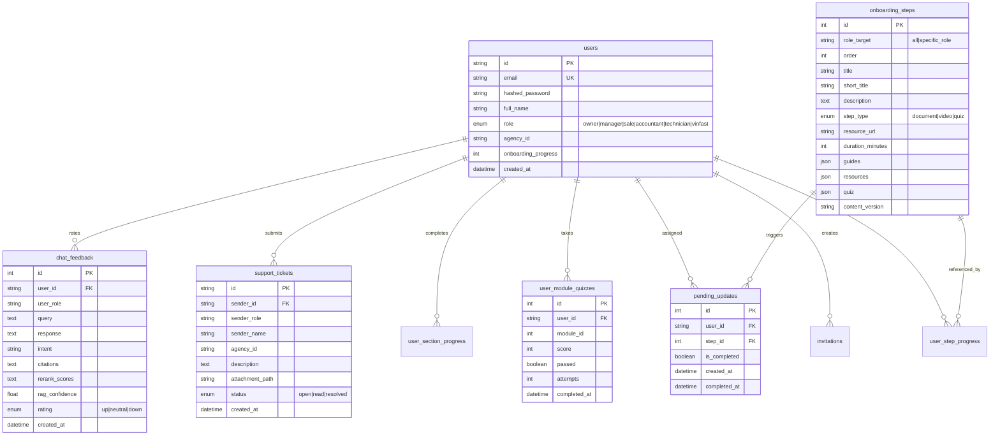

# 📋 Đặc tả Yêu cầu Phần mềm — VF AI Onboarding & Dealership Assistant (P-223)

> **Phiên bản**: 2.0.0 (Nhánh hội tụ `deploy`)  
> **Ngày cập nhật**: 23/08/2026  
> **Đơn vị phát triển**: AI20K Build Phase — Cohort 3  
> **Repository**: [AI20K-Build-Phase-Cohort-3/P-223](https://github.com/AI20K-Build-Phase-Cohort-3/P-223)

---

## 1. Tổng quan Hệ thống (System Overview)

### 1.1 Mục tiêu dự án
Hệ thống **Trợ lý AI Onboarding & Vận hành Đại lý VinFast** là nền tảng toàn diện giải quyết hai bài toán cốt lõi:
1. **Track 1 — Đào tạo & Khảo thí nhân sự (Onboarding Platform)**: Chuẩn hóa quy trình hòa nhập cho nhân viên mới thuộc các đại lý phân phối xe máy điện VinFast thông qua lộ trình học tập cá nhân hóa theo từng vai trò (Kế toán, Kỹ thuật viên, Sales, Quản lý, Chủ đại lý), kèm hệ thống kiểm tra trắc nghiệm thông minh và cơ chế tự động cập nhật kiến thức khi có tài liệu chính sách mới từ VinFast HQ.
2. **Track 2 — Trợ lý AI Hỏi đáp Nghiệp vụ (RAG AI Assistant)**: Chatbot RAG thế hệ mới hỗ trợ giải đáp 24/7 tức thì các nghiệp vụ bán hàng, bảo hành, kỹ thuật sửa chữa xe máy điện, tích hợp tra cứu video trực quan có mốc thời gian (timeline chapter markers) và hệ thống đánh giá chất lượng phản hồi liên tục (Human-in-the-Loop Feedback Loop).

### 1.2 Kiến trúc Hệ thống Tổng thể

```
┌────────────────────────────────────────────────────────────────────────────────────────┐
│                               FRONTEND (React 18 + Vite + TypeScript)                  │
│  ├─ Auth & Invite           ├─ CourseViewer (PDF/Video Player + Chapter Markers)       │
│  ├─ Onboarding Roadmap      ├─ FileExplorer & S3 Manager (Batch Upload + Role Picker)  │
│  ├─ Progress Dashboard      ├─ Support Tickets & Inbox                                 │
│  └─ AI Chatbot Widget (Citations + Human-in-the-Loop Feedback ↑/−/↓)                   │
└───────────────────────────────────────────┬────────────────────────────────────────────┘
                                            │ REST API (Bearer JWT Auth)
┌───────────────────────────────────────────▼────────────────────────────────────────────┐
│                             BACKEND (FastAPI + Python 3.11 + Uvicorn)                  │
│  ├─ Auth & RBAC Routes        ├─ S3 Document Manager Routes (Batch Upload, Re-index)   │
│  ├─ Onboarding & Quiz Routes  ├─ Support Ticket Routes (Presigned S3 URLs)             │
│  ├─ Chat & Feedback Routes    ├─ Pending Update Routes (Forced Delta Quizzes)          │
├───────────────────────────────────────────┬────────────────────────────────────────────┤
│           LANGGRAPH AI AGENT              │              RAG INGESTION & SEARCH        │
│  ├─ Intent Router (LLM Classifier)        │  ├─ Ingestion: PyMuPDF / MinerU OCR        │
│  ├─ RAG Hybrid Search Node                │  ├─ PII Masking: Microsoft Presidio + Regex│
│  ├─ Workflow & Procedure Node             │  ├─ Dense Embedding: BAAI/bge-m3 (1024d)   │
│  ├─ Troubleshooting Engine                │  ├─ Sparse Retrieval: BM25 (underthesea)   │
│  └─ Human Escalation Node                 │  ├─ Reranker: CrossEncoder ms-marco-MiniLM │
│                                           │  └─ ChromaDB Persistent Vector Store       │
├───────────────────────────────────────────┼────────────────────────────────────────────┤
│           DATABASE & STORAGE              │          EVALUATION & OBSERVABILITY        │
│  ├─ PostgreSQL 15 / SQLite (SQLAlchemy)   │  ├─ Langfuse (Tracing, Latency, Token Cost)│
│  ├─ MinIO S3 Object Storage (Docker)      │  ├─ Braintrust (Cloud Benchmark & Eval)    │
│  └─ ClamAV Antivirus Scanner (TCP 3310)   │  ├─ RAGAS Framework (Precision, Faithfulness)
│                                           │  └─ Retrieval Debugger (Canary Test Suite) │
└────────────────────────────────────────────────────────────────────────────────────────┘
```

---

## 2. Ma trận Phân quyền — RBAC (Role-Based Access Control)

Hệ thống hỗ trợ **6 vai trò người dùng** với phạm vi quyền hạn phân định nghiêm ngặt:

| Chức năng / Quyền hạn | VinFast Admin (`vinfast`) | Chủ đại lý (`owner`) | Quản lý (`manager`) | Nhân viên Sales (`sale`) | Kế toán (`accountant`) | Kỹ thuật viên (`technician`) |
|:---|:---:|:---:|:---:|:---:|:---:|:---:|
| **Đăng nhập & Xác thực JWT** | ✅ | ✅ | ✅ | ✅ | ✅ | ✅ |
| **Duyệt Kho Tài Liệu MinIO (`/files`)** | ✅ | ✅ | — | — | — | — |
| **Upload / Xóa tài liệu MinIO** | ✅ | — | — | — | — | — |
| **Kích hoạt Re-index ChromaDB** | ✅ | — | — | — | — | — |
| **Xem Lộ trình Onboarding** | — *(Admin)* | ✅ | ✅ | ✅ | ✅ | ✅ |
| **Làm Quiz & Nhận chứng chỉ Module** | — | ✅ | ✅ | ✅ | ✅ | ✅ |
| **Hoàn thành bài kiểm tra cập nhật (`PendingUpdate`)** | — | — | — | ✅ | ✅ | ✅ |
| **Sử dụng AI Chatbot Tra cứu** | — | ✅ | ✅ | ✅ | ✅ | ✅ |
| **Đánh giá Chat Feedback (↑/−/↓)** | — | ✅ | ✅ | ✅ | ✅ | ✅ |
| **Xem Dashboard Tiến độ Đại lý (`/progress`)** | — | ✅ *(Toàn đại lý)*| ✅ *(Nhóm)* | — | — | — |
| **Mời nhân viên mới vào đại lý (`/invite`)** | — | ✅ | — | — | — | — |
| **Tạo Ticket yêu cầu hỗ trợ** | — | ✅ | ✅ | ✅ | ✅ | ✅ |
| **Xem & Xử lý Ticket hỗ trợ từ Đại lý** | ✅ | ✅ | ✅ | — | — | — |

---

## 3. Yêu cầu Chức năng Chi tiết (Functional Requirements)

### FR-01: Xác thực, Phân quyền & Quản trị Đại lý
- **FR-01.1 (Đăng ký Owner)**: Cho phép Chủ đại lý đăng ký tài khoản mới kèm định danh đại lý (`agency_id`, vd: `VF-HN-001`).
- **FR-01.2 (Đăng nhập)**: Xác thực qua Email và Password; trả về JWT Access Token mã hóa HS256 kèm thông tin profile và vai trò người dùng.
- **FR-01.3 (Mời thành viên)**: Chủ đại lý gửi lời mời qua email cho nhân viên với các vai trò cụ thể (`accountant`, `technician`, `sale`, `manager`). Hệ thống sinh token lời mời dùng một lần.
- **FR-01.4 (Đồng bộ Enum & DB)**: Khởi tạo hệ thống tự động kiểm tra và cập nhật các giá trị `UserRole` mới vào PostgreSQL Enum, đồng thời chuyển đổi an toàn các role cũ.
- **FR-01.5 (Tài khoản VinFast HQ)**: Tài khoản quản trị `vinfast@vinfast.vn` có quyền quản lý tập trung toàn bộ kho tài liệu, độc lập với lộ trình học tập của học viên.

### FR-02: Lộ trình Đào tạo Onboarding Cá nhân hóa (Track 1)
- **FR-02.1 (Catalog chuẩn hóa)**: Mỗi vai trò có cây danh mục bài học gồm 3 Module chuẩn hóa:
  - *Module 1*: Lịch sử, Văn hóa Vingroup & Quy tắc ứng xử chung.
  - *Module 2*: Quy trình vận hành, Quy định làm việc & Dịch vụ chuẩn đại lý.
  - *Module 3*: Nghiệp vụ chuyên sâu từng vị trí (Kế toán chiết khấu/claim, Kỹ thuật bảo hành xe máy điện, Bán hàng 8 bước...).
- **FR-02.2 (Theo dõi Tiến độ Idempotent)**: Lưu trữ tiến độ theo từng bước (`UserStepProgress`) và từng phần tài liệu (`UserSectionProgress`). Tiến độ hoàn thành (%) được tính toán động và bảo toàn khi tải lại trang.
- **FR-02.3 (Khảo thí & Mở khóa Module)**: Mỗi Module kết thúc bằng bài trắc nghiệm 4 lựa chọn (`UserModuleQuiz`). Học viên phải đạt điểm tối thiểu (≥80%) mới mở khóa Module kế tiếp.
- **FR-02.4 (Dashboard Tiến độ)**: Quản lý và Chủ đại lý theo dõi trạng thái học tập của toàn bộ nhân viên trong đại lý (Chưa bắt đầu, Đang học, Đã hoàn thành).

### FR-03: Quản lý Lưu trữ MinIO & Ingestion Tự động (Track 1 ↔ Track 2)
- **FR-03.1 (Duyệt cây thư mục MinIO)**: Cho phép VinFast Admin và Chủ đại lý duyệt toàn bộ cấu trúc bucket `vinfast-onboarding` theo folder phân cấp.
- **FR-03.2 (Upload trực tiếp kèm Role Dropdown)**: VinFast Admin tải file lên thư mục chỉ định, chọn vai trò mục tiêu (`auto`, `all`, `accountant`, `sale`, `technician`, `manager`, `owner`).
- **FR-03.3 (Cảnh báo Trùng file & Batch Upload)**: Hỗ trợ chọn nhiều file cùng lúc, tự động phát hiện file đã tồn tại và hiển thị cảnh báo xác nhận ghi đè trước khi tải lên.
- **FR-03.4 (Contextual AI Quiz Generator)**: Khi upload tài liệu mới ngoài catalog:
  - Trích xuất văn bản PDF bằng PyMuPDF.
  - Tự động gọi LLM Agent (`generate_quiz_and_match_step`) để tạo Section bài học mới, gán đúng Module và tự động sinh 3-5 câu hỏi trắc nghiệm kèm giải thích.
  - Tự động sinh `PendingUpdate` yêu cầu các nhân sự cũ đã tốt nghiệp phải làm bài kiểm tra bổ sung.
- **FR-03.5 (Xóa tài liệu an toàn)**: Xóa file trên MinIO đồng thời dọn dẹp các ràng buộc khóa ngoại trong DB (`UserStepProgress`, `PendingUpdate`, `OnboardingStep`).
- **FR-03.6 (Nút Trigger Re-index ChromaDB)**: Cung cấp endpoint nền (`/api/v1/s3-manager/reindex-chromadb`) qua FastAPI `BackgroundTasks`. VinFast Admin có thể kích hoạt đồng bộ toàn bộ tài liệu mới vào kho Vector của Chatbot trực tiếp từ giao diện chỉ với 1 click.

### FR-04: AI Chatbot RAG & Tra cứu Đa phương tiện (Track 2)
- **FR-04.1 (LangGraph Multi-Agent Engine)**: Luồng xử lý phân luồng linh hoạt:
  - `intent_classifier`: Phân loại ý định người dùng (`RAG_SEARCH`, `WORKFLOW`, `TROUBLESHOOTING`, `CREATE_TICKET`, `GENERAL_QA`).
  - `rag_node`: Tìm kiếm thông tin chính xác theo phân quyền vai trò.
  - `workflow_node`: Trả lời các quy trình từng bước.
  - `troubleshoot_node`: Phân tích và hướng dẫn sửa chữa sự cố xe máy điện.
  - `escalation_node`: Đề xuất tạo ticket hỗ trợ khi không tìm thấy lời giải.
- **FR-04.2 (Hybrid Retrieval Pipeline)**:
  - *Dense Retrieval*: Model `BAAI/bge-m3` (1024 chiều, vector search qua ChromaDB).
  - *Sparse Retrieval*: Model BM25 với bộ tách từ tiếng Việt chuyên dụng (`underthesea`).
  - *Fusion & Re-ranking*: Kết hợp RRF (Reciprocal Rank Fusion) và CrossEncoder (`cross-encoder/ms-marco-MiniLM-L-6-v2`) để lấy Top-3 chunk chính xác nhất.
- **FR-04.3 (Trình phát Video Thông minh)**:
  - Nhận diện chunk nguồn là video và trích xuất mốc thời gian (`timestamp_seconds`).
  - Phục vụ video an toàn qua URL Stream có hỗ trợ Range Request.
  - Giao diện `VideoSourcePlayer` hiển thị thanh tiến trình video với các Chapter Marker đổi màu theo điểm số `rerank_score`, tự động nhảy (auto-seek) đến phân đoạn chứa câu trả lời.
- **FR-04.4 (LLM Providers)**: Tích hợp OpenRouter (`gpt-4o-mini`, `anthropic/claude-3.5-sonnet`) làm kênh chính và Google Gemini (`gemini-1.5-flash` / `gemini-2.0-flash`) làm kênh dự phòng (fallback).

### FR-05: Thu thập Đánh giá & Giám sát Hệ thống (Observability & Eval)
- **FR-05.1 (Human-in-the-Loop Feedback)**: Widget đánh giá 3 trạng thái (↑ Hữu ích, − Chưa rõ, ↓ Sai) dưới từng câu trả lời AI, lưu trữ vào bảng `chat_feedback` phục vụ tinh chỉnh RAG.
- **FR-05.2 (Langfuse Tracing)**: Tự động ghi nhận chi tiết từng lượt gọi LLM, độ trễ từng node, số lượng token tiêu thụ và chi phí vận hành.
- **FR-05.3 (Braintrust Benchmark)**: Bộ test benchmark tự động đánh giá độ chính xác của Agent trên đám mây.
- **FR-05.4 (RAGAS Metric Evaluation)**: Đo lường chất lượng bộ ba RAG Triad: *Context Precision* (>0.70), *Faithfulness* (>0.85), và *Answer Relevancy* (>0.80).
- **FR-05.5 (Retrieval Debugger & Canary Testing)**: Module chẩn đoán lỗi truy xuất độc lập trong `retrieval_debugger/`, hỗ trợ kiểm tra mã bí mật Canary (`XKCD-98765-VINFAST-CANARY`) để phát hiện suy giảm hiệu năng tìm kiếm.

### FR-06: Hệ thống Yêu cầu Hỗ trợ (Support Tickets)
- **FR-06.1 (Gửi Ticket)**: Nhân viên tại đại lý có thể gửi ticket hỗ trợ kèm file đính kèm (hình ảnh/tài liệu) lưu trữ trên MinIO.
- **FR-06.2 (Hộp thư Hỗ trợ)**: VinFast Admin và Quản lý xem danh sách ticket, tải file đính kèm qua Presigned URL có thời hạn, đếm số lượng ticket chưa đọc qua Badge hiển thị thời gian thực.

---

## 4. Yêu cầu Phi chức năng (Non-Functional Requirements)

### NFR-01: An toàn & Bảo mật Thông tin
- **NFR-01.1**: Mật khẩu người dùng được băm một chiều bằng thuật toán `bcrypt` (`passlib`).
- **NFR-01.2**: Xác thực phiên làm việc thông qua JSON Web Token (JWT) có thời hạn, bảo vệ toàn bộ các endpoint nghiệp vụ.
- **NFR-01.3 (Quét PII)**: Mọi tài liệu trước khi đưa vào kho vector ChromaDB đều được quét và che giấu thông tin định danh cá nhân (Số điện thoại, CCCD, Email, Địa chỉ) bằng **Microsoft Presidio** kết hợp bộ lọc Regex Tiếng Việt.
- **NFR-01.4 (Quét Virus & Mã độc)**: File upload được kiểm tra an toàn qua kết nối socket ClamAV Daemon trước khi lưu vào MinIO.
- **NFR-01.5 (S3 Client Timeout)**: Mọi kết nối Boto3 tới MinIO S3 đều được thiết lập cứng cấu hình `Config(connect_timeout=3, read_timeout=5, retries={'max_attempts': 1})` để ngăn chặn hiện tượng treo server khi mạng cục bộ gián đoạn.

### NFR-02: Hiệu năng & Khả năng Phản hồi
- **NFR-02.1**: Thời gian phản hồi trung bình cho các API nghiệp vụ Onboarding, Auth, Ticket đạt `< 500ms`.
- **NFR-02.2**: Thời gian xử lý hoàn tất một lượt hỏi đáp RAG (bao gồm Intent classification, Hybrid search, CrossEncoder rerank và LLM streaming) đạt `< 5s`.
- **NFR-02.3**: Quá trình khởi động ứng dụng thực hiện nạp trước (warm-up) mô hình Embedding và Reranker vào RAM/VRAM GPU.

### NFR-03: Độ tin cậy & Khả năng Mở rộng
- **NFR-03.1**: Toàn bộ hệ sinh thái dịch vụ nền (PostgreSQL, MinIO S3, ClamAV, Langfuse) được đóng gói và triển khai đồng nhất qua `docker-compose.yml`.
- **NFR-03.2**: Bộ kiểm thử tự động đạt **100% tỷ lệ vượt qua (Pass)** trên toàn bộ 139+ test cases unit và integration tests.
- **NFR-03.3**: Toàn bộ mã nguồn backend tuân thủ chuẩn định dạng và linter `ruff check` với 0 lỗi phát sinh.

---

## 5. Đặc tả Giao diện API (REST API Specification)

### 5.1 Nhóm Xác thực & Quản trị Nhân sự (`/api/v1/auth`)
| Phương thức | Đường dẫn Endpoint | Quyền hạn (Role) | Mô tả chức năng |
|:---|:---|:---:|:---|
| `POST` | `/register` | Public | Đăng ký tài khoản Chủ đại lý (Owner) |
| `POST` | `/login` | Public | Đăng nhập hệ thống, nhận JWT Access Token |
| `GET` | `/me` | `Any` | Lấy thông tin tài khoản đang đăng nhập |
| `POST` | `/invite` | `owner` | Tạo mã mời nhân viên mới vào đại lý |
| `GET` | `/onboarding/steps` | `owner, manager, sale, accountant, technician` | Lấy danh mục bài học theo vai trò (VinFast trả về `[]`) |
| `GET` | `/onboarding/progress` | `owner, manager, sale, accountant, technician` | Lấy tiến độ học tập chi tiết của học viên |
| `POST` | `/onboarding/steps/{step_id}/complete` | `owner, manager, sale, accountant, technician` | Đánh dấu hoàn thành một bước học tập |
| `POST` | `/onboarding/sections/{section_id}/complete` | `owner, manager, sale, accountant, technician` | Đánh dấu hoàn thành một phần tài liệu |
| `POST` | `/onboarding/quizzes/submit` | `owner, manager, sale, accountant, technician` | Nộp bài kiểm tra trắc nghiệm Module |
| `GET` | `/manager/team-progress` | `owner, manager` | Xem bảng tổng hợp tiến độ toàn bộ nhân viên đại lý |
| `POST` | `/support/tickets` | `Any` | Tạo ticket yêu cầu hỗ trợ mới |
| `GET` | `/support/tickets` | `vinfast` | Xem danh sách toàn bộ ticket hỗ trợ |
| `GET` | `/support/tickets/unread-count` | `vinfast` | Đếm số ticket chưa đọc (Badge) |
| `PATCH`| `/support/tickets/{ticket_id}/read` | `vinfast` | Đánh dấu ticket đã xử lý/đã đọc |
| `GET` | `/support/tickets/files/{object_key}` | `vinfast` | Lấy Presigned URL tải file đính kèm từ MinIO |
| `GET` | `/pending-updates` | `Any` | Danh sách bài kiểm tra bổ sung cần hoàn thành |
| `POST` | `/pending-updates/{update_id}/complete` | `Any` | Đánh dấu hoàn thành bài kiểm tra bổ sung |

### 5.2 Nhóm Quản lý Tài liệu MinIO & Ingestion (`/api/v1/s3-manager`)
| Phương thức | Đường dẫn Endpoint | Quyền hạn (Role) | Mô tả chức năng |
|:---|:---|:---:|:---|
| `GET` | `/explore` | `vinfast, owner` | Duyệt cấu trúc cây thư mục MinIO theo prefix |
| `POST` | `/upload-direct` | `vinfast` | Tải file lên MinIO, gán role mục tiêu, sinh Quiz AI |
| `DELETE`| `/delete` | `vinfast` | Xóa file khỏi MinIO và cập nhật catalog bài học |
| `POST` | `/reindex-chromadb` | `vinfast` | Kích hoạt tác vụ nền Re-index ChromaDB & BM25 |
| `GET` | `/reindex-status` | `vinfast` | Kiểm tra trạng thái tiến trình Re-index |

### 5.3 Nhóm Trợ lý AI & Feedback (`/api/v1`)
| Phương thức | Đường dẫn Endpoint | Quyền hạn (Role) | Mô tả chức năng |
|:---|:---|:---:|:---|
| `POST` | `/chat` | Public / Token | Gửi câu hỏi cho AI RAG Agent (nhận câu trả lời + video timestamp) |
| `POST` | `/feedback` | `Any` | Gửi đánh giá hài lòng câu trả lời (↑ / − / ↓) |
| `GET` | `/feedback/stats` | `owner, manager, vinfast` | Báo cáo thống kê tỷ lệ hài lòng RAG |
| `GET` | `/files/{path}` | `Any` | Stream tài liệu học tập / video hướng dẫn |

---

## 6. Cấu trúc Cơ sở Dữ liệu (Database Schema)



---

## 7. Phụ lục Tiêu chuẩn & Đánh giá Chất lượng Dự án

1. **Bộ Test Tự Động**: Toàn bộ hệ thống được bảo vệ bởi test suite bao phủ các kịch bản Authentication, RBAC Guard, S3 Ingestion, LangGraph Agent Intent, RAG Retrieval và Feedback Loop.
2. **Tiêu chuẩn Codebase**: Sử dụng Type Hinting (Python 3.11+ / TypeScript), tuân thủ định dạng linter `ruff`, `eslint` và chuẩn thiết kế RESTful API.
3. **Cơ chế Khắc phục Thảm họa (Disaster Recovery)**: Dữ liệu cấu hình bài học chuẩn được lưu trữ dự phòng dưới dạng Code (`onboarding_catalog.py`), tự động tái tạo bảng và đồng bộ dữ liệu vào Database khi triển khai môi trường mới.
